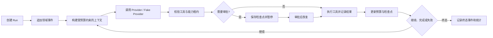
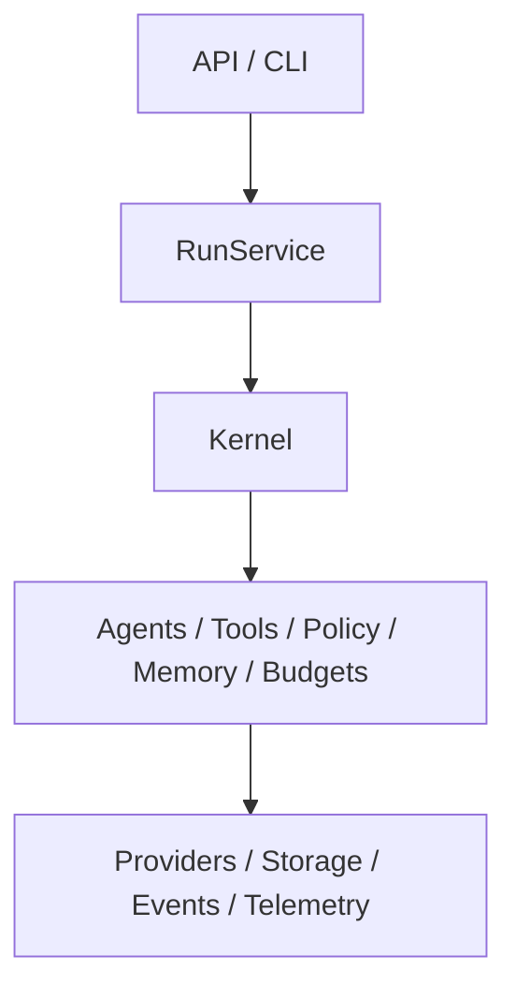

# AgentCell 开发步骤

## 1. 文档目的

本文是对仓库根目录 `AGENTS.md` 的工程化拆解。它把产品目标、架构约束、安全边界和完成标准转换为可按顺序执行、可测试、可交接的开发步骤。

本文不替代 `AGENTS.md`。若两者冲突，以 `AGENTS.md` 为准；每次开始实现前仍须重新检查根目录和目标子目录中的 `AGENTS.md`。

## 2. 分析结论

### 2.1 系统真正的主链路

AgentCell 的主链路不是“模型加聊天界面”，而是以下可恢复执行闭环：



因此，事件、生命周期、预算、权限和检查点必须早于完整 UI 建设；否则暂停恢复、回放、审批和审计会被迫返工。

### 2.2 架构依赖必须单向



执行中必须守住以下边界：

- `kernel` 不依赖 FastAPI、Typer 或前端协议；
- API 和 CLI 只做输入输出适配，不复制业务编排；
- Provider 厂商差异只存在于 Provider 适配器；
- Tool 不直接获取全局数据库会话；
- ORM 模型不越过 Repository 边界；
- SSE 由领域事件映射，不成为新的业务事件源；
- React 只消费稳定 DTO，不复制后端状态机、预算或权限判断。

### 2.3 高风险能力是核心功能，不是收尾项

文件写入、Shell、网络和子 Agent 委派都会扩大影响范围。实现这些能力时必须同时交付：

- 结构化参数和 Pydantic 校验；
- `ToolPolicy`、风险等级和能力租约校验；
- 路径、命令、域名、超时和输出大小限制；
- 审批或拒绝分支；
- 开始、完成、失败和预算事件；
- 幂等性声明及正确的重试策略；
- 对应的单元或集成测试。

不得先实现“能执行”，再把安全和恢复能力留到以后补。

### 2.4 交付单位应是垂直切片

每个阶段都应尽量贯通领域模型、业务实现、存储、一个用户入口、测试和文档。目录按职责逐步生长，不按建议树一次性创建所有实现文件。

首个可运行闭环应使用 Fake Provider，在不消耗线上额度的情况下验证：

```text
创建 Run → 追加事件 → Fake Provider 输出 → 更新预算 → 创建检查点 → 完成 Run
```

在这个闭环稳定后，再接入真实 Provider、危险工具和产品界面。

### 2.5 M1–M4 的实际依赖关系

- M1 建立可运行微内核，是所有后续工作的前置条件。
- M2 在 M1 的生命周期和事件模型上加入安全执行、恢复、记忆与多 Agent。
- M3 只把已稳定的业务能力暴露为 API、SSE、CLI 和 Web 产品界面。
- M4 是扩展生态，不得反向拖慢首版单机闭环。

## 3. 开发总原则

每一步遵循同一工作流：

1. 阅读作用域内的说明、代码、测试和配置；
2. 明确本次变更所属层及允许依赖方向；
3. 定义最小输入、输出、错误、事件和预算边界；
4. 先写或同步写关键测试；
5. 完成最小实现，不提前抽象不存在的第二实现；
6. 运行相关最小测试；
7. 运行 Ruff、Pyright 和完整后端测试；
8. Web 变更另运行类型检查、Vitest、构建及必要的 Playwright 检查；
9. 检查迁移、配置、API 和文档是否同步；
10. 更新 `docs/handoff.md`，准确记录已完成、未完成和风险。

## 4. 分阶段开发步骤

## 阶段 0：工程基线与责任边界

### 目标

让仓库具备清晰、可追踪的工程入口，但不伪装成已经可运行的产品。

### 实施内容

- 建立 `src/agentcell` 包边界及领域子包；
- 建立 `tests`、`migrations`、`web` 和 `docs` 工作区；
- 配置 `pyproject.toml` 中的 Python 3.12、构建、Ruff、Pyright 和 pytest 基线；
- 添加 `.gitignore`、`.env.example` 和不包含明文密钥的 `agentcell.toml` 示例；
- 添加包结构烟雾测试；
- 建立开发步骤和交接文档。

### 验收门槛

- 目录职责与 `AGENTS.md` 的依赖方向一致；
- 不存在空实现、虚假 Provider、虚假 API 或未使用的生产依赖；
- Python 3.12 环境中可以导入 `agentcell` 及其边界包；
- 文档明确说明当前不可运行的部分。

### 当前状态

本轮已完成骨架和文档创建。运行时、数据库、CLI、API 和 Web 应用均尚未实现。

## 阶段 1：领域契约、生命周期与预算

### 目标

先定义整个系统都会依赖的稳定语义，避免各模块自行维护状态字符串和预算算法。

### 实施内容

1. 在 `errors.py` 建立可分类的项目错误层次，但不吞掉原始上下文；
2. 在 `kernel/lifecycle.py` 定义 Run 状态和唯一合法状态转换；
3. 在 `events/models.py` 定义事件信封、版本、时间、Run 内序号和首批 payload；
4. 在 `budgets/models.py` 定义 `Budget`、Usage 与预算快照；
5. 在 `budgets/tracker.py` 实现请求、Token、工具、时间、费用和子 Agent 配额检查；
6. 统一 UUID、UTC 时间、Decimal 费用和序列化约定。

### 必测内容

- 所有合法与非法状态转换；
- 每种预算达到上限、刚好等于上限和超限的行为；
- 子预算不得超过父 Run 剩余额度；
- 事件 payload 的版本化校验和敏感字段脱敏；
- 时间和 Decimal 的稳定序列化。

### 验收门槛

- 其他模块不能直接修改 Run 状态字符串；
- 预算超限返回明确领域错误，不静默截断；
- 领域模型不依赖 FastAPI、Typer 或 SQLAlchemy ORM。

### 当前状态

阶段 1 已于 2026-07-10 完成：项目错误层次、唯一 Run 状态转换表、24 个核心事件名称、版本化事件信封与首批 payload、递归敏感字段脱敏、Budget/Usage/Remaining/Snapshot 模型、请求与工具预留、真实模型 Usage 记账、持续时间和子预算边界均已实现并通过单元测试。下一步进入阶段 2。

## 阶段 2：SQLite、事件存储与迁移

### 目标

建立事件优先、只追加、可并发读取的最小持久化基础。

### 实施内容

1. 加入 SQLAlchemy 2、Alembic 和 aiosqlite；
2. 创建数据库工厂，并在连接初始化时启用 WAL、外键和 5000ms busy timeout；
3. 首个迁移只创建 M1 实际使用的表，优先包含 `runs`、`run_events` 和必要关联；
4. 实现 EventStore/Repository，让其返回领域模型而非 ORM 实例；
5. 使用数据库唯一约束保证 `(run_id, sequence)` 唯一；
6. 明确事务边界，确保状态变更和对应事件不会形成不可解释的半完成状态。

### 必测内容

- 临时数据库初始化和 PRAGMA；
- 同一 Run 事件序号严格递增；
- 历史事件不可更新；
- 并发追加时唯一约束和重试行为；
- Repository 不泄露 ORM 实例；
- Alembic 从空库升级和降级的最小验证。

### 验收门槛

- 生产 Schema 只由 Alembic 变更；
- 测试使用独立临时数据库；
- 大 payload 不直接进入事件表，预留 Artifact 引用语义。

### 当前状态

阶段 2 已于 2026-07-10 完成：异步 SQLite 工厂、WAL/外键/5000ms busy timeout、Run 领域模型、独立 ORM 表、首个 Alembic 迁移、RunRepository、只追加 EventStore、数据库原子 sequence 分配、唯一约束、禁止历史事件 UPDATE/DELETE 的触发器、64 KiB 内联 payload 上限和 Artifact 引用契约均已实现。临时数据库、迁移升降级、事务回滚、外键、payload 往返、超限拒绝和多连接并发追加测试已通过。下一步进入阶段 3。

## 阶段 3：Provider 工程与离线 Fake Provider

### 目标

先稳定统一模型边界，再接入百炼和 DeepSeek 的差异参数。

### 实施内容

1. 定义 `ModelSpec`、模型输出事件、Usage 和分类错误；
2. 定义最小 Provider 接口，以实际的 Fake Provider 和真实适配器需求驱动抽象；
3. 实现确定性 Fake Provider，支持文本、工具调用、流式片段、Usage 和故障注入；
4. 实现 `ProviderFactory`，按 `model_ref` 创建模型，Agent 不判断厂商名称；
5. 接入百炼和 DeepSeek，厂商参数仅保留在对应适配器；
6. 支持注入 HTTPX Client、独立超时、代理、连接池和错误映射；
7. 真实 Provider 测试仅在明确环境开关和密钥存在时运行。

### 必测内容

- Fake Provider 的确定性和故障场景；
- 普通文本、流式、Function Calling、多轮工具、Usage；
- 认证、限流、超时、上游错误和上下文超限分类；
- 仅对允许的 Provider 错误重试；
- API Key、Authorization Header 和完整请求体不进入日志。

### 验收门槛

- 默认测试不访问网络、不消耗线上额度；
- 不发生未记录事件的静默 Provider 降级；
- Agent、Tool、API 中没有厂商条件分支。

### 当前状态

阶段 3 已于 2026-07-10 完成：严格 ModelSpec、AgentCellSettings、统一 Usage/输出事件、Provider 分类错误、重试资格判断、可注入 HTTPX Client、ProviderFactory、百炼与 DeepSeek 官方适配器，以及脚本化 Fake Provider 均已实现。离线契约已覆盖文本、固定流式分片、Function Calling、多轮工具、Usage、故障注入、厂商参数映射和敏感响应体不泄漏；真实 Provider 测试需要 `AGENTCELL_RUN_LIVE_PROVIDER_TESTS=1` 与对应 API Key 同时存在。下一步进入阶段 4。

## 阶段 4：ToolRegistry、能力租约与首批安全工具

### 目标

用一个完整安全路径验证工具注册、参数校验、能力判断、事件和预算更新。

### 实施顺序

1. 定义 `RiskLevel`、`ToolPolicy`、工具调用和工具结果模型；
2. 定义 `CapabilityLease` 及父子租约子集校验；
3. 实现 ToolRegistry 和统一执行器；
4. 首先实现只读的 `workspace.list/read/search`；
5. 实现工作区路径解析、符号链接逃逸防护、敏感路径拒绝和大文件分块；
6. 为工具输出增加字节上限和 Artifact 转存接口；
7. 最后再加入 `workspace.write/patch/delete`、Shell、HTTP 和其他工具。

### 必测内容

- 路径穿越、绝对路径、符号链接逃逸和敏感文件；
- 缺少能力、越权租约和子 Agent 权限扩大；
- 工具参数错误、超时、输出截断和错误分类；
- 非幂等工具绝不自动重试；
- `tool.proposed/started/completed/failed` 与 `budget.updated` 顺序。

### 验收门槛

- 未声明能力默认拒绝；
- Shell 默认关闭且使用参数数组执行；
- 网络默认 HTTPS 白名单，禁止云元数据地址和本机敏感端口；
- 删除和危险命令必须审批或拒绝。

### 当前状态

阶段 4 已于 2026-07-13 完成：RiskLevel、Capability、ToolPolicy、CapabilityLease、父子租约缩权、PolicyEngine、ToolRegistry 和统一 ToolExecutor 均已实现。`workspace.list/read/search` 已形成参数校验、默认拒绝、租约范围、预算预留、事件 Sink、超时、输出字节上限和 Artifact 转存的完整安全路径。临时工作区测试覆盖盘符/UNC/父目录穿越、敏感文件、租约越界、Windows junction 逃逸、二进制文件、UTF-8 分块、有限搜索、超时、异常脱敏和非幂等工具不重试。Shell、网络、写入和删除工具仍未注册，下一步进入阶段 5。

### 危险工具的后续归属

阶段 4 实施顺序中的“最后再加入 `workspace.write/patch/delete`、Shell、HTTP 和其他工具”不表示这些能力应在只读安全切片中直接开放。它们必须等依赖的安全基础完成后再统一实现：

- 阶段 5 保持只读，只验证 RunService、Fake Provider、EventStore、预算和首批安全工具的 M1 闭环；
- 阶段 6 先完成审批持久化、参数修改审批、检查点、暂停恢复和非幂等操作防重放；
- 阶段 7 先完成 Artifact Store，让大型 Diff、命令输出和 HTTP 响应能够外置、恢复和安全引用；
- 随后进入“阶段 7.1：生产工具扩展”，再实现写入、删除、Shell 和 HTTP 工具。

不得为了让阶段 5 功能看起来完整而使用临时布尔值、绕过审批、无限内存输出或无恢复语义的方式提前开放危险工具。

## 阶段 5：RunService 与首个 M1 端到端闭环

### 目标

使用 Fake Provider 和只读工具完成真正可运行、可审计的单 Run 闭环。

### 实施内容

1. 定义无状态 `AgentSpec`、AgentRegistry 和 AgentFactory；
2. 通过 `RunDeps` 注入 Run、工作区、事件、策略、预算和 Agent Registry；
3. 实现 Run 创建、上下文构建、模型调用、工具执行、预算更新和终态；
4. 每个关键状态先形成领域事件，再由存储和输出适配器消费；
5. 每个工具或模型边界都配置超时和分类错误；
6. 实现最小 Typer CLI，直接调用 RunService；
7. 提供 JSON 输出和 Ctrl+C 取消语义。

### 必测内容

- 无工具文本任务完整生命周期；
- 单次和多次只读工具调用；
- 模型失败、工具失败、预算超限和用户取消；
- 事件顺序、终态和统计一致；
- CLI 直接调用服务而非本机 HTTP。

### 验收门槛

- `agentcell run` 可用 Fake Provider 离线完成任务；
- Run 的每个终态都有对应最终事件；
- M1 最小闭环可在进程内重复测试且结果确定。

### 完成情况（2026-07-13）

阶段 5 已完成。当前已实现无状态 `AgentSpec`、`AgentRegistry`、`AgentFactory`、Run 级依赖注入、EventStore 事件 Sink、PydanticAI 模型与工具循环、模型文本增量、预算记账，以及 `completed`、`failed`、`cancelled` 终态。`agentcell run --offline-fake` 可直接调用 RunService 离线执行，支持 `--json`；Ctrl+C 通过任务取消语义进入 `run.cancelled`。集成测试覆盖无工具文本、单次/多次只读工具、Provider 失败、工具失败、请求预算超限、取消和 CLI 持久化。

阶段 5 仍严格保持只读。审批持久化、检查点、恢复、回放和分支属于阶段 6；Artifact Store 属于阶段 7；写入、删除、Shell 和 HTTP 属于阶段 7.1。

## 阶段 6：审批、检查点、恢复、回放与分支

### 目标

把“可恢复”落实为可验证的产品能力，而不是简单重试。

### 实施内容

1. 建立审批领域模型和 `approvals` 表；
2. 对 Guarded/Dangerous 工具生成影响、Diff、剩余预算、幂等性和超时信息；
3. 在等待审批前保存包含消息、预算、未完成工具和父子关系的检查点；
4. 实现批准、拒绝、修改参数后批准和当前 Run 临时同类批准；
5. 实现幂等恢复、取消、历史回放和指定事件序号分支；
6. 防止恢复时重复执行已完成的非幂等工具。

### 必测内容

- 审批暂停后进程重启恢复；
- 批准、拒绝和参数修改分支；
- 相同恢复请求的幂等行为；
- 回放得到相同最终状态；
- 分支只继承指定序号之前的状态；
- 非幂等工具不会重复执行。

### 验收门槛

- `waiting_approval` 和 `paused` 的语义清晰且转换唯一；
- 检查点内容足以恢复，不依赖进程内对象；
- 永久全局批准不作为默认能力。

### 完成情况（2026-07-13）

阶段 6 已完成。审批使用 PydanticAI 原生 `DeferredToolRequests/DeferredToolResults`；`approvals`、`checkpoints` 和 `tool_executions` 由 Alembic revision `20260713_0002` 创建。RunService 支持审批暂停、进程重启后批准/拒绝/修改参数恢复、当前 Run 临时同类批准、幂等取消和重复恢复冲突检测。ReplayService 支持完整/前缀回放与检查点支持的指定 sequence 分支；持久化工具执行账本阻止已开始的非幂等调用在恢复时重复执行。

测试覆盖审批展示字段、重启恢复、三类决定、同类临时授权、重复恢复、回放一致性、分支来源边界和非幂等防重放。阶段 6 没有注册任何写入、删除、Shell 或 HTTP 工具；下一步进入阶段 7 的记忆、上下文压缩与 Artifact。

## 阶段 7：记忆、上下文压缩与 Artifact

### 目标

在不引入向量数据库的前提下，让长任务和历史任务可持续运行。

### 实施内容

1. 实现 Working、Conversation、Episodic、Semantic 四层记忆模型；
2. 使用 SQLite FTS5、BM25、时间衰减、重要度和作用域评分；
3. 实现 Memory Policy、去重、过期、敏感信息处理和必要审批；
4. 实现 `PairSafeTrimmer`，保证工具调用和工具结果成对保留；
5. 实现 `ToolOutputCompactor`、`EpisodicSummarizer` 和 `MemoryInjector`；
6. 实现 Artifact Store，并让大型工具输出只通过摘要和引用进入上下文；
7. 为摘要使用低成本、低温度、关闭深度思考的模型配置。

### 必测内容

- FTS5 检索排序和作用域隔离；
- 记忆去重、过期、编辑和删除；
- 工具调用/结果配对裁剪；
- 大输出转 Artifact 后可恢复加载；
- 压缩前后关键任务状态不丢失。

### 完成情况（2026-07-13）

阶段 7 已完成。新增 Working、Conversation、Episodic、Semantic 四层领域模型和作用域安全的 `MemoryService`；Alembic revision `20260713_0003` 创建 `memory_items`、`memory_fts`、同步触发器及 `artifacts`。检索综合 FTS5 BM25、30 天半衰期、重要度、标签和用户/项目/Agent 作用域，写入经过凭据拒绝、Semantic 显式批准、去重和过期策略。

运行时已接入 `MemoryInjector → PairSafeTrimmer → ToolOutputCompactor`，召回和压缩形成领域事件；`EpisodicSummarizer` 强制使用独立、低温度、关闭深度思考的模型配置。文件 Artifact Store 提供大小上限、受控路径、原子写入、内容去重、SHA-256/字节数加载校验，并把消息中的 Artifact UUID 保存进检查点。测试覆盖检索排序与隔离、CRUD/过期/策略、成对裁剪、运行时召回事件、大输出外置、篡改检测及进程重启后恢复加载。

阶段 7 仍未注册写入、删除、Shell 或 HTTP 工具；下一步进入阶段 7.1 的生产工具扩展。

## 阶段 7.1：生产工具扩展

### 前置条件

只有同时满足以下条件才开始本阶段：

- 阶段 6 的审批、检查点、暂停恢复和非幂等防重放测试已经通过；
- 阶段 7 的 Artifact Store 已可持久化、加载、校验哈希并随检查点恢复；
- ToolExecutor 仍是参数、能力、预算、事件、超时和输出限制的唯一执行入口。

### 实施内容

1. 实现 `workspace.write` 和 `workspace.patch`：写入前生成 Diff，使用工作区路径与 `filesystem.write` 租约校验，并默认要求审批；
2. 实现 `workspace.delete`：标记为 DANGEROUS 和非幂等，必须审批，恢复时不得重复删除；
3. 实现 `shell.run/test`：默认关闭，只接受参数数组和命令白名单，限制 cwd、环境变量、超时和输出大小，禁止 `shell=True`；
4. 实现 `http.request`：只允许 HTTPS 白名单，DNS 解析后的所有地址必须再次检查，重定向逐跳复核，禁止本机、私网、链路本地和云元数据地址；
5. 对 POST、PUT、PATCH、DELETE 等非只读 HTTP 方法默认要求审批，并禁止非幂等自动重试；
6. 将大型 Diff、Shell 输出和 HTTP 响应写入 Artifact，事件和模型上下文只保留摘要与引用；
7. 为每次危险操作保存审批关联、参数摘要、能力租约、预算、事件和检查点信息。

### 必测内容

- 写入和补丁的路径穿越、symlink/junction 逃逸、敏感路径和审批 Diff；
- 删除批准、拒绝、取消、恢复和非幂等防重放；
- Shell 参数注入、命令白名单、环境泄漏、超时、输出超限和 Ctrl+C；
- HTTP DNS rebinding、重定向绕过、IPv4/IPv6 私网、元数据地址、响应超限和非只读审批；
- 大输出转 Artifact 后能够恢复加载，且事件、日志和模型上下文不包含完整敏感内容；
- 子 Agent 不能通过生产工具扩大父 Run 的文件、命令或网络权限。

### 验收门槛

- 不存在绕过 ToolExecutor、CapabilityLease 或审批服务的生产工具调用路径；
- 写入、删除、Shell 和非只读网络操作在未获得有效审批时无法执行；
- 进程重启恢复不会重复执行已经完成的非幂等操作；
- Shell 仍明确属于进程级约束，不宣称具备强沙箱隔离。

### 完成情况（2026-07-13）

阶段 7.1 已完成。`workspace.write/patch/delete` 使用统一路径解析、读写双作用域、敏感路径拒绝、symlink/junction 防护、审批前 unified Diff、`expected_sha256` 并发保护和原子写入；删除保持 DANGEROUS、非幂等且受持久化执行账本保护。大型 Diff 保存为 Artifact，并将引用纳入审批和检查点。

`shell.run/test` 只接受命令名和参数数组，使用清洗后的绝对 PATH 解析、工作区 cwd、环境白名单、进程超时和合并输出上限，不使用 `shell=True`；两者均按非幂等危险工具处理。`http.request` 只允许经过租约批准的 HTTPS 443，逐跳检查域名、全部 DNS 地址、固定连接 IP、Host/TLS SNI、真实 peer、重定向、请求头、敏感 query、请求/响应大小，并禁用环境代理。当前对所有 HTTP 方法采取更严格的逐次审批和非幂等策略。

测试覆盖批准前不执行、Diff 重启恢复、哈希冲突、创建/补丁/删除、junction 逃逸、命令白名单、argv 注入、环境泄漏、输出超限/Artifact、私网 DNS、DNS 固定、子域重定向、敏感参数、响应上限和大型 Diff 检查点引用。下一步进入阶段 8 的多 Agent 协作与预算继承。

## 阶段 8：多 Agent 协作与预算继承

### 目标

在父 Run 可控的权限和预算内实现 Agent as Tool 与程序化 Handoff。

### 实施内容

1. 实现 coordinator、coder、reviewer、researcher、summarizer 配置；
2. reviewer 默认只读；
3. 实现 Agent as Tool 的结构化请求和结果；
4. 实现 Coordinator → Coder → Reviewer → Finalizer 的程序化切换；
5. 从父 Run 剩余额度分配请求、Token、工具、费用、时长、子 Agent 数和深度；
6. 记录父子 Run、Trace、事件和检查点关联；
7. 禁止子 Agent 权限或预算超过父 Agent。

### 必测内容

- 最大深度、最大子 Agent 数和预算耗尽；
- 子租约严格为父租约子集；
- reviewer 无法写文件；
- 子 Agent 失败、取消和超时能正确回传父 Run；
- 父子事件和 Trace 关联稳定。

### 完成情况（2026-07-13）

阶段 8 已完成。当前提供 coordinator、coder、reviewer、researcher、summarizer 和显式 finalizer 配置；reviewer 在 AgentSpec 层保持只读。`agent.delegate` 通过统一 ToolExecutor 执行能力校验、工具预算和审计事件，子租约只能缩权，子预算在启动前适配父剩余容量，完成后将真实请求、Token、工具、费用、后代数量和深度回卷父预算，持续时间使用父子各自墙钟避免重复计算。

新增 `agent_delegations` 持久化投影、父子专用事件 payload、OpenTelemetry API Span、delegation/handoff 检查点，以及基于 PydanticAI `CallDeferred/DeferredToolResults` 的子审批暂停恢复。Agent as Tool 在启动子 Run 前先暂停并保存父 Provider 上下文；子 Run 终态与结构化委派结果在同一事务提交。重启时，尚未启动的子 Run 可继续执行，已中断且没有自身检查点的子 Run 会安全失败并将结果交回父 Agent，避免盲目重放危险工具。

程序化 Handoff 使用不直接调用模型的根工作流 Run，确定性执行 Coordinator → Coder → Reviewer → Finalizer，每阶段均创建真实子 Run、委派记录和恢复检查点；子终态结算窗口可从持久化结果恢复，协程取消会同步收敛根 Run、活动子 Run 和委派状态。测试覆盖额度结算、只读 reviewer、父子关联、审批后子/父连续恢复、子执行中断、终态结算故障窗口、Handoff 取消、四阶段顺序、迁移和既有回归。下一步进入阶段 9。

## 阶段 9：FastAPI、AG-UI/SSE 与 CLI 完整化

### 目标

将稳定的 RunService 能力暴露为产品接口，不在适配层复制业务逻辑。

### 实施内容

1. 创建 FastAPI 应用工厂、依赖注入和统一错误模型；
2. 实现 Runs、Agents、Memories、Providers、Tools、Health 和 Version 路由；
3. 将领域事件映射为 AG-UI/SSE；
4. 使用事件序号支持 SSE 断线续传；
5. 对 resume、branch、cancel 定义幂等或冲突语义；
6. 完整实现 CLI 的 inspect、replay、branch、cancel、agents、tools 和 memory；
7. 确保敏感配置不通过 API 返回。

### 必测内容

- API Schema 和统一错误；
- SSE 顺序、重连和终态；
- 路由不包含业务编排；
- CLI JSON 输出和退出码；
- API/CLI 与 RunService 的集成行为一致。

### 完成情况（2026-07-13）

阶段 9 已完成。新增共享 `AgentCellApplication` 组合根、FastAPI 应用工厂、稳定 Pydantic DTO 和统一 Problem Details；Runs/Approvals/Agents/Memories/Providers/Tools/Health/Version 路由均调用既有业务服务。Run 创建使用进程内 Supervisor 后台执行，取消、审批恢复、委派恢复和分支恢复仍由 RunService 决定状态与幂等/冲突语义。

领域事件通过 `ag-ui-protocol` 官方事件模型和 `EventEncoder` 映射为 SSE。复合 `sequence.offset` ID 解决一个领域事件映射多个 AG-UI 事件的问题，并支持 `Last-Event-ID` 精确续传；预算、审批、子 Agent、记忆和上下文事件保留为命名 `CUSTOM` 事件。Agent API 定义由 revision `20260713_0005` 持久化，Provider 输出不包含密钥环境变量或端点私密配置。

CLI 现提供 run、inspect、replay、branch、resume、cancel、serve、agents list、tools list 和 memory search，资源命令支持 JSON 输出且继续直接调用业务服务。测试覆盖统一错误、SSE 顺序/重连/终态、工具 ID、Agent 重启持久化、分支恢复、CLI JSON/退出码、迁移与既有回归。阶段 9.1 已在其后完成。

## 阶段 9.1：会话线程与多轮上下文

### 目标

让用户在同一 Conversation 中连续提交多个任务。每个用户回合创建独立 Run，并自动继承经过裁剪、压缩、脱敏和作用域校验的历史消息、工具结果与项目上下文。

多轮会话不是简单聊天套壳。每个回合仍必须具有独立的生命周期、预算、权限、审批、事件和检查点。

### 核心语义

1. Conversation 是多个有序 Run 的容器；
2. 每次用户追问创建新 Run，不恢复已经 `completed` 的 Run；
3. 新 Run 自动加载该 Conversation 的有界历史消息；
4. 请求、Token、工具、费用和持续时间预算按 Run 重新分配；
5. 跨回合不继承临时审批，也不得扩大上一 Run 的能力租约；
6. Conversation 必须固定并校验用户、项目、工作区和 Agent 作用域；
7. 工具调用与工具结果必须成对恢复，大型历史内容使用 Artifact 引用；
8. 完整有序消息线程与可检索的 Conversation Memory 分开存储和治理；
9. 同一 Conversation 默认只允许一个活动 Run；
10. 不持久化原始模型思维链。

### 实施内容

1. 新增 Conversation 领域模型、ConversationService 和小型 Repository；
2. 通过独立 Alembic revision 创建 `conversations` 与 `messages`；
3. 为会话消息保存 Conversation 内单调递增 sequence、Run 关联、角色、版本化 payload 和 Artifact 引用；
4. 保存用户消息、助手最终消息及恢复上下文所需的工具调用/结果，不复制完整领域事件流；
5. RunService 创建新回合时加载历史，并复用 `PairSafeTrimmer`、`ToolOutputCompactor` 和摘要能力；
6. 对历史消息执行用户、项目、工作区和 Agent 作用域校验；
7. 实现 `POST /api/conversations`、列表、详情和消息查询；
8. 实现 `POST /api/conversations/{conversation_id}/runs` 创建下一回合；
9. 为并发回合定义稳定的 409 冲突语义和可选的最后消息序号前置条件；
10. 实现 `agentcell chat`，支持创建会话、按 Conversation ID 继续和安全退出；
11. 进程重启后可从 SQLite 恢复会话并继续追问；
12. 更新 AG-UI thread/run 映射，使一个 Conversation 下的多个 Run 保持清晰边界。

### 必测内容

- 第二轮能够引用第一轮用户消息和助手结果；
- 第二轮能够引用第一轮工具结果，且 ToolCall/ToolReturn 不失配；
- `completed` Run 不被错误恢复，下一轮使用新 Run ID；
- 同一 Conversation 的 Run 与消息 sequence 稳定；
- 同一 Conversation 并发创建活动 Run 返回冲突；
- 不同用户、项目、工作区、Agent 和 Conversation 之间上下文隔离；
- 新回合不会继承上一 Run 的剩余预算或临时审批；
- 大型历史内容转换为 Artifact 摘要和引用；
- 进程重启后能够继续同一 Conversation；
- `agentcell chat`、HTTP API 与 RunService 行为一致；
- 真实 Provider 两回合测试必须显式开启，默认套件使用 Fake Provider。

### 完成标准

用户可以创建一个 Conversation，连续提交至少两个回合；第二个回合能正确引用第一个回合的事实和工具结果，同时形成两个独立、可审计、受预算与权限约束的 Run。

### 完成情况（2026-07-14）

阶段 9.1 已完成。revision `20260714_0006` 创建 `conversations` 与 `messages`；ConversationService 固定用户、项目、工作区和 Agent 作用域，以原子 `active_run_id` 拒绝并发根回合，并在异常或终态释放占用。每轮使用独立 RunRequest、Budget、CapabilityLease 和审批状态，已完成 Run 不会被 resume 为下一轮。

消息投影保存用户文本、助手文本和成对工具调用/结果，剥离 ThinkingPart 与 Provider 私有元数据；大型工具结果经 Artifact 外置。历史由已完成 Run 构建，并复用消息数与 Token 双阈值的 PairSafe 裁剪。Conversation API、`agentcell chat`、跨进程继续、作用域拒绝、并发冲突、独立 Run ID、稳定 sequence 和 AG-UI Conversation→Run 映射已有测试。该基础随后进入阶段 9.2 的 CLI 执行闭环。

## 阶段 9.2：CLI Agent、权限与流式执行闭环

### 目标

在进入 Web 工作台前，把现有 Agent、CapabilityLease、审批、领域事件和 Conversation 能力完整暴露为安全、可理解、可恢复的 CLI 体验。`coder` 能在明确边界内修改和测试代码，`coordinator` 默认继续只读；终端能够实时展示文本、工具、审批、预算和安全推理摘要。

### 核心语义

1. AgentSpec 决定 Agent 最多拥有哪些工具，CapabilityLease 决定本次 Run 最多可访问哪些路径、命令和网络范围，PermissionMode 只决定已租用操作何时需要人工审批；三者不得合并成一个绕过入口；
2. `--agent coder` 是用户对编码角色的显式选择，默认权限模式仍为“请求审批”；选择 Agent 不等于批准具体写入、命令或危险操作；
3. `coordinator` 默认保持只读。权限模式不得为 AgentSpec 增加其未声明的工具或能力；
4. Conversation 固定 Agent 作用域。继续已有 Conversation 时不得用 `--agent` 静默切换角色；需要更换 Agent 时创建新 Conversation 或使用显式 Handoff；
5. 权限模式按 Run 重新应用，不跨回合继承临时批准；自动审批也必须形成审批决定、事件、检查点和执行账本；
6. CLI 流式输出直接消费应用服务和领域事件，不通过本机 HTTP，也不建立第二套运行状态；
7. “安全推理摘要”只能来自可公开的进度/证据摘要或模型显式最终说明，不得输出、持久化或回放 ThinkingPart、Provider reasoning_content 或原始思维链。

### 权限模式

统一增加 `--permission-mode request|auto|full`，用户界面分别显示“请求审批”“替我审批”“当前工作区完全访问”：

| 模式 | GUARDED | DANGEROUS | FORBIDDEN |
| --- | --- | --- | --- |
| `request` | 每次请求用户审批 | 每次请求用户审批 | 始终拒绝 |
| `auto` | PolicyEngine 在租约和参数校验通过后自动批准 | 仍请求用户审批 | 始终拒绝 |
| `full` | 在显式租约内自动批准 | 在显式租约内自动批准并完整审计 | 始终拒绝 |

其中“替我审批”是 AgentCell PolicyEngine 的确定性策略决定，不是让模型批准自己的工具调用。`full` 仅表示当前工作区和显式命令/网络租约内不再逐次询问，不得绕过工作区边界、敏感文件拒绝、symlink/junction 防逃逸、命令 argv/白名单、网络 SSRF 防护、预算、超时、输出限制或非幂等执行账本；不得支持隐式 `*` 命令或永久全局批准。

### CLI 设计

```powershell
uv run agentcell run --agent coder --permission-mode request "修复测试失败"
uv run agentcell chat --agent coder --permission-mode request --workspace .
uv run agentcell run --agent coder --allow-write . --allow-command pytest --permission-mode auto "修复并测试"
uv run agentcell chat --conversation-id <conversation-id> --permission-mode request
```

- `--allow-write <relative-path>` 可重复，生成规范化 `filesystem_write` 租约；绝对路径、工作区逃逸和敏感路径在参数解析阶段直接拒绝；
- `--allow-command <executable>` 可重复，只接受可解析的命令名，不接受拼接 Shell 字符串、通配命令或 `shell=True`；具体 argv 仍由工具 Schema、命令策略和审批共同约束；
- `--agent coder` 未提供租约覆盖时使用内置 coder 的最小工作区配置：读写仅限当前工作区，命令仅来自项目配置的安全命令列表，默认 `permission-mode=request`；若没有已配置命令，Shell 工具应不可见而不是使文件编辑能力整体不可用；
- `--agent`、租约参数和权限模式同时适用于 `run` 与新建 `chat`；继续已有 Conversation 时只允许提供与固定 Agent 一致的值；
- 交互式审批至少显示 Agent、Provider/模型、工具、风险、参数摘要、Diff、命令 argv、预计影响、剩余预算、幂等性和超时，支持批准、拒绝、修改参数后批准及仅当前 Run 的同类临时批准；
- 非交互环境若需要人工审批必须明确失败或暂停并返回稳定退出码，不得因 stdin 不可用而自动批准。

每个 Chat 回合结束时统一输出：

```text
run_id=<run-id> conversation_id=<conversation-id> status=completed ...
```

执行 `/exit`、`/quit` 或正常 EOF 时输出：

```text
Continue with:
uv run agentcell chat --conversation-id <conversation-id>
```

### ChangeSet、Git 辅助审计与安全回滚

文件修改不能只依赖审批时的一次 Diff。阶段 9.2 必须增加 transport-neutral 的 `ChangeService`、Run 级 `ChangeSet` 和逐文件 `FileChange`，让非 Git 工作区也能查看与恢复；Git 只作为存在时的增强信息源，不得成为恢复正确性的唯一依据。

每个 ChangeSet 至少保存：

- ChangeSet、Run、Conversation、Agent、工具调用和审批关联；
- 工作区、可选 Git 仓库根的受控相对标识、初始分支/HEAD OID 和初始 dirty 状态摘要；
- 只属于本 Run 的 FileChange 顺序、状态、Diff 和 Artifact 引用；
- 创建、应用、完成、冲突、回滚时间和来源 ChangeSet；
- 存储字节、保留策略和预算占用。

每个 FileChange 至少保存：

- 规范化工作区相对路径和 created/replaced/patched/deleted/reverted 操作；
- `before_sha256`、`after_sha256`，不存在的一侧使用 `None`；
- 修改前和修改后的完整内容 Artifact，以及完整 unified Diff Artifact；
- Git 基线 HEAD、该路径 Run 开始前的 dirty 状态、执行后的 path-scoped Git Diff Artifact；
- `prepared/applied/completed/conflict/failed/reverted` 状态；
- 原变更、反向变更、审批决定和 Provider tool-call 关联。

文件系统与 SQLite 无法组成同一原子事务，因此必须使用可恢复状态机：

1. `prepared`：参数、租约和路径校验通过后，先保存 before 快照、预期 after 哈希、完整 Diff、Git 路径基线和审批；
2. 用户或 PolicyEngine 批准后执行现有 expected-hash 原子文件操作；
3. `applied`：重新读取目标并验证 after 哈希，保存 after Artifact；
4. `completed`：提交 FileChange、工具结果、预算和事件；
5. 若进程在文件替换后、账本完成前退出，恢复时比较当前哈希：等于 after 则补写完成，等于 before 才允许按既有批准继续，二者都不等则进入 `conflict`，不得盲目重放或覆盖；
6. 回滚创建新的反向 FileChange，不删除、更新或伪造原历史。

Git 集成采用只读 `GitWorkspaceInspector`，使用参数数组执行有界的 `rev-parse`、`status --porcelain=v2 -z` 和 path-scoped `diff --no-ext-diff`。它必须关闭 pager、外部 diff 和可选锁，使用清洗环境、超时和输出上限；不得让模型直接读取 `.git`。仓库根位于工作区外时只允许返回工作区内路径的状态和 Diff，不得泄露仓库其他目录。Git 不存在、工作区不是仓库或 HEAD 尚不存在时，ChangeSet/回滚仍必须依靠 Artifact 和 SHA-256 正常工作。

Run 开始时的 dirty 文件必须单独标记为用户既有修改。AgentCell 只能归因和回滚本 Run 实际触碰的路径，不得把 HEAD 与工作树的全部差异归因给 Agent。分支或 HEAD 在 Run 中途变化时记录冲突/警告，不自动切换分支。

安全回滚规则：

- modified/patched：仅当当前哈希仍等于原 `after_sha256` 时，展示反向 Diff 并从 before Artifact 恢复；
- created：仅当当前哈希仍等于原 `after_sha256` 时，经审批删除；
- deleted：仅当路径仍不存在时，经审批从 before Artifact 恢复；
- 当前内容、路径类型、Git HEAD 或作用域发生冲突时停止并要求人工处理；
- 回滚继续经过 AgentSpec、CapabilityLease、PermissionMode、Diff 审批、预算、事件、Checkpoint 和非幂等执行账本；`full` 也不能跳过哈希冲突；
- 禁止自动执行 `git reset --hard`、`git checkout -- .`、`git restore .`、`git clean`、`git stash`、`git commit` 或 `git push`。提交和推送若未来提供，必须是独立、显式、路径受控的 DANGEROUS 工作流，不属于阶段 9.2 自动回滚路径。

CLI/API 至少提供：

```text
agentcell changes list --run <run-id>
agentcell changes show <change-id>
agentcell changes diff <change-id>
agentcell changes revert <change-id>

GET  /api/runs/{run_id}/changes
GET  /api/changes/{change_id}
GET  /api/changes/{change_id}/diff
POST /api/changes/{change_id}/revert
```

`show/diff` 必须能在 Run 完成和进程重启后读取内联 Diff 或完整 Artifact；`revert` 创建新 Run 或受控工具执行并返回稳定 ID，不得直接在查询路由中修改文件。大型快照和 Diff 必须计入 Artifact/存储预算，支持保留期和清理策略；存在未回滚变更、审批、检查点或审计引用时不得提前清理。

### 流式与可观测输出

1. 默认对 TTY 启用 Rich 流式渲染，增加 `--stream/--no-stream`；JSON 模式不混入 ANSI 文本；
2. 实时展示 `model.text_delta`，避免最终结果再次重复打印已流式文本；
3. 展示工具 proposed/started/completed/failed、审批等待与决定、子 Agent、上下文压缩、预算更新和 Run 终态；
4. 工具参数、Diff 和输出继续执行脱敏与大小限制，大内容只显示摘要和 Artifact ID；
5. 安全推理视图展示“正在分析、读取哪些证据、为何请求某项工具、如何形成最终结论”等公开摘要；原始思维链永不进入 CLI、事件、消息表、日志或 Artifact；
6. 断点恢复时按事件 sequence 继续渲染，已经显示的文本和工具事件不得重复；Ctrl+C 必须取消活动 Run 并保存终态事件；
7. 如提供机器流式模式，应使用独立 `--json-events` NDJSON 输出稳定 DTO，不复用 Rich 文本解析。

### 实施内容

1. 为 `agentcell run` 增加 `--agent`，统一 `run` 与 `chat` 的 Agent 解析和 Conversation Agent 校验；
2. 增加 PermissionMode 领域模型和 PolicyEngine 决策来源，区分 human、policy-auto 和 policy-full，禁止 model 作为审批主体；
3. 增加 CLI 租约构建器，集中处理 `--allow-write`、`--allow-command`、工作区规范化、AgentSpec 上限和最小权限默认值；
4. 调整有效工具集合，使未授予命令租约时只隐藏 Shell 工具，不阻断 coder 的读写工具；
5. 将自动审批接入现有 deferred approval、checkpoint、budget、event 和 tool execution ledger，不创建旁路执行器；
6. 抽取 `run`/`chat` 共用的 Rich 事件渲染器和审批交互器，直接订阅已持久化领域事件；
7. 完成每回合 Conversation ID、退出续聊命令、流式文本、工具状态、预算和安全推理摘要输出；
8. 新增 ChangeSet/FileChange 领域模型、状态机、Repository、Alembic 迁移、ChangeService 和版本化事件 payload；
9. 在 workspace.write/patch/delete 的审批预览与执行边界保存 before/after Artifact、哈希、操作 Diff，并实现崩溃窗口对账；
10. 实现可选 GitWorkspaceInspector、Run 初始 Git 基线、既有 dirty 归因隔离和 path-scoped Git Diff；
11. 实现 changes list/show/diff/revert CLI 与只读查询/显式回滚 API，回滚复用审批和执行账本；
12. 更新 CLI 帮助、README、API/CLI、安全边界和测试文档，不把未实现选项写成当前可用命令。

### 必测内容

- `run --agent coder` 与 `chat --agent coder` 选择正确 Agent，每个 Chat 回合仍创建独立 Run；
- coordinator 在三种权限模式下都不能获得写工具，reviewer 始终只读；
- coder 默认 request 模式，写入/补丁显示 Diff 并暂停等待决定；
- auto 仅自动批准租约内 GUARDED，DANGEROUS 仍等待人工；
- full 仅自动批准显式租约内操作，敏感路径、逃逸路径、未授权命令和 FORBIDDEN 始终拒绝；
- 自动批准决定有主体、模式、理由、事件、检查点和账本，恢复后不重复执行非幂等工具；
- `--allow-write` 和 `--allow-command` 的重复值、非法值、Windows 路径、大小写及跨平台规范化；
- Conversation Agent 不匹配返回明确冲突，权限模式和临时批准不跨回合静默继承；
- 流式文本不重不漏，工具/审批/预算/子 Agent 顺序稳定，重连或恢复按 sequence 去重；
- TTY、非 TTY、`--no-stream`、`--json`、`--json-events`、Ctrl+C 和 EOF 行为；
- 每轮完成行包含 Run ID 和 Conversation ID，退出始终给出可复制的继续命令；
- 输出、事件、日志和消息中不存在 API Key、敏感工具参数或原始模型思维链。
- 非 Git 工作区、新仓库无 HEAD、Git 可执行文件缺失时仍能查看和回滚 AgentCell FileChange；
- dirty 工作区只归因本 Run 触碰的路径，不覆盖或回滚用户既有无关修改；
- 创建、修改、补丁、删除分别保存 before/after Artifact、哈希和完整 Diff，重启后仍可查询；
- 文件替换前、替换后但账本完成前、Artifact 保存中和终态提交中的故障注入能确定性对账；
- 当前哈希等于 after 时可审批回滚，等于其他值时稳定返回冲突；重复回滚不重复产生副作用；
- 大文件/Diff Artifact 篡改、缺失和超预算边界安全失败；
- Git clean/dirty、untracked/ignored、无 HEAD、非 Git、Git 不可用和基础路径编码边界；高级 worktree/submodule、分支中途切换和嵌套仓库故障注入下沉到阶段 11；
- 任何自动路径都不会执行 reset/checkout/restore/clean/stash/commit/push，Git 命令使用 argv、超时、清洗环境和输出上限。

### 完成标准

用户能够在默认请求审批模式下通过 `agentcell run --agent coder` 或 `agentcell chat --agent coder` 安全修改项目、查看 Diff、决定审批并运行显式允许的测试命令；终端实时显示可审计进度并在每轮及退出时给出稳定 Run/Conversation 标识。每项 workspace 工具文件变化在 Git 和非 Git 工作区中都能按 Run 查询完整历史，并在当前哈希未变化时执行显式反向变更。三种权限模式均不突破 CapabilityLease 和安全默认拒绝边界，完整离线回归通过后进入阶段 9.2.1 正确性收口。

### 实现进展（2026-07-14）

阶段 9.2 核心闭环已实现。`run` 与 `chat` 共用 Agent/租约构建逻辑，coder 默认获得工作区读写而不隐式获得命令；有效工具集合是 AgentSpec 工具与 Run 租约的交集。`request/auto/full` 已接入唯一 ToolExecutor，自动批准会持久化 Approval 决策来源、Diff、事件和执行账本，FORBIDDEN 与所有路径/命令边界继续拒绝。

CLI 已按持久化事件 sequence 流式展示公开文本、工具、审批、预算、子 Agent、上下文和文件变更状态，`--no-stream` 不重复最终文本；人工审批展示完整影响信封，Chat 每轮输出 Run/Conversation ID，退出和 EOF 输出续聊命令。CLI 不读取、输出或保存 Provider 原始推理内容。

revision `20260714_0007` 已创建 `change_sets` 与 `file_changes`。workspace.write/patch/delete 在副作用前保存 before/after Artifact、SHA-256 和完整 Diff，副作用后重新校验并写入 `prepared/applied/completed/conflict` 状态；恢复路径会按当前哈希补全已应用记录或标记冲突。账本对单个 FileChange 和单个 Run 设置逻辑存储字节上限，超限在 Artifact 落盘和文件副作用前失败；反向变更使用同一额度并原子累计。可选 Git inspector 只执行受控只读 argv，保存 HEAD、分支、路径 dirty 状态和 path-scoped Diff；Git 不可用时仍由 Artifact 和哈希保证查询与恢复。CLI/API 已提供 changes list/show/diff/revert，回滚创建反向 FileChange，当前哈希或 Git HEAD 不匹配时拒绝覆盖。

当前离线套件为 205 passed、6 个付费真实 Provider 测试按开关跳过，Ruff 与 Pyright 通过。阶段 9.2 的核心闭环已经完成，但真实 Provider 运行暴露出恢复身份、工具预检、UTF-8 分页和最终文本校验等正确性问题，因此先进入 9.2.1 收口，再进行 9.2.2 CLI 产品化和 9.3 确定性团队入口。ChangeSet/Artifact 清理、高级 Git 场景和独立回滚 Run 不再阻塞 CLI/Web 主链路，统一下沉到阶段 11。

## 阶段 9.2.1：正确性收口与稳定基线

### 目标

只修复会造成错误完成、错误审批、错误恢复或真实 Provider 不可用的问题，形成可提交、可迁移、可回放的稳定后端基线。本阶段不重做 CLI 参数、不接通新的多 Agent 入口、不实现完整 Rich Live UI，也不以高级 Git/Artifact 生命周期工作阻塞正确性修复。

### 实施顺序

1. 固定审批恢复身份：Run/Checkpoint 持久化并校验 `agent_id`、AgentSpec 版本或快照、`model_ref`、Provider 和模型；`resume` 默认继承原值，显式模型切换必须记录事件；
2. 在审批前完成无副作用 Tool preflight，顺序固定为 Schema → scope/preflight → Approval → budget/ledger → side effect；Shell 预检 command、argv、cwd 和清理后的 PATH；
3. 对参数合法但不在租约、且模型可以纠正的调用最多触发一次预算内 Tool ModelRetry；第二次仍越界则明确失败，禁止自动改写命令或扩权；
4. 修复审批终端热键、pending 语义和重启后的 `inspect → resume`，确保批准、拒绝、修改参数、同类临时批准均使用原模型和原租约；
5. 修复 `workspace.read` 的 UTF-8 起始边界：区分非法 UTF-8 与 offset 落在 continuation byte，返回 requested/actual/next offset。先以 `next_offset_bytes` 完成兼容修复；只有出现文件版本竞争需求时再引入绑定哈希的 opaque Cursor；
6. 增加窄范围、Provider-neutral 的 FinalOutputGuard：仅在最终回答窗口拒绝以已知 DSML/未解析 Function Call/未完成工具意图为主体的输出；第一次拒绝允许一次计入预算的无工具最终回答重试，第二次以 `invalid_final_output` 失败并记录 `model.output_rejected`；
7. 确保失败、等待审批和取消路径都输出或返回稳定 `run_id`、`conversation_id`、状态和错误码，不能只打印模糊的 `Run failed`；
8. 收紧变更回滚 API：服务端从原 Run、ChangeSet 和当前调用身份推导有效租约，客户端不得自行声明可扩大权限的 CapabilityLease；当前哈希保护和显式确认继续保留；
9. 优先改善压缩后 Artifact 的有界内联摘要与真实工具目录一致性。只有测试证明任务确实需要重新读取已引用大内容时，才增加只允许当前 Run/Conversation 引用范围的 `artifact.load`，不提供任意枚举；
10. 补齐恢复、审批前拒绝、UTF-8 中文分页、合法 DSML 文本正例、伪工具协议反例和回滚越权测试；执行迁移升降级、Ruff、Pyright、完整离线套件及显式开启的 Qwen/DeepSeek 冒烟测试。

### 完成门禁

- 暂停后恢复不因 TOML 顺序、默认模型或持久化 Agent 覆盖而静默切换执行身份；
- 所有安全拒绝都发生在副作用前，未授权调用不得先产生 `tool.approved`；
- 合法中文 UTF-8 文件从任意 continuation offset 读取不会误报 binary，真实非法 UTF-8 仍稳定拒绝；
- DeepSeek DSML/伪工具调用不能产生 `run.completed` 或 Conversation 最终消息，合法讲解协议的内容不被误拒绝；
- CLI/API 的失败终态可定位到稳定 Run，回滚权限由服务端推导；
- 当前完整离线套件、Ruff、Pyright、迁移升降级和两家 Provider 的显式冒烟测试通过；
- 将这一状态形成独立、可审查的稳定提交后，才进入 9.2.2。

## 阶段 9.2.2：CLI 收敛与可读执行体验

### 目标

在不改变后端 AgentSpec → CapabilityLease → Tool 参数校验 → Approval 分层的前提下，减少常规命令参数，统一 `run/chat/resume` 的配置构建，并将裸领域事件转换为安全、可读、可复用的执行展示。本阶段仍保持单 Agent，不接通 `--team` 或自主委派。

### CLI 收敛原则

- 建立唯一 `CliRunProfile`/选项模型；`--agent` 选择角色上限，profile 在上限内生成最小可用 Lease；
- 将 `--permission-mode` 收敛为 `--approval-mode request|auto|full`，旧参数保留一个版本的隐藏兼容别名；
- coder 默认可写当前工作区但不默认获得命令，常规命令不再要求 `--allow-write .`；需要缩小时使用 `--write-scope`；
- 常用测试使用 `--command-profile pytest|ruff|pyright`，高级入口 `--command` 只授予精确 executable；不新增 `--allow-read`、`--allow-delegate`、`--allow-all`；
- `researcher` 只有显式 `--network-domain` 时才获得 HTTP 租约；
- `full` 仅自动审批当前有效租约内操作，不代表任意文件、命令或网络；
- `run`、`chat` 和 `resume` 共用 profile 构建器和帮助语义。

目标常用命令：

```powershell
uv run agentcell run --agent coder --model-ref deepseek_pro --approval-mode request --command-profile pytest --workspace G:\Agent-Playground "修复测试"
uv run agentcell chat --agent coder --model-ref qwen_plus --approval-mode request --workspace G:\Agent-Playground
```

只有需要限制范围或使用高级命令时再增加参数：

```powershell
uv run agentcell run --agent coder --write-scope src --write-scope tests --command ruff --approval-mode full "修复并检查"
```

### 可读工作动态与回答双区

当前 `CliEventRenderer` 将事件技术名称和内部参数逐行写入终端，导致重复文件读取刷屏，用户也难以区分模型临时说明与最终答案。阶段 9.2.2 将事件存储、展示投影和具体 UI 分开：

```text
DomainEvent（权威、可回放）
        ↓
RunDisplayProjector（纯映射、去重、聚合、脱敏）
        ↓
RunDisplayState（CLI/Web 共用稳定 DTO）
        ├── Rich LiveRunView（终端）
        └── AG-UI/SSE 安全展示语义（阶段 10 复用）
```

建议的展示状态至少包含：

```text
phase              working / answering / waiting_approval / completed / failed
activities         最近活动、聚合计数、状态和安全详情
answer_candidate   当前模型回合的临时文本
answer             已确认的最终回答
budget             请求、工具、Token、缓存和耗时的已用/上限
active_approval     待审批工具、影响和风险摘要
active_agent       Agent、Provider、模型和子 Agent 状态
```

TTY 目标效果：

```text
╭─ Agent 正在工作 · Coder / DeepSeek ─────────────────────────╮
│ ✓ 已扫描项目根目录 · 23 项                                  │
│ ✓ 已读取测试文件 · 9 个 · 最近 tests/test_sandbox.py         │
│ ● 正在运行测试 · pytest tests/ -v                           │
│ 请求 4/10 · 工具 13/20 · Token 20.8K/240K · 缓存命中 35%   │
╰──────────────────────────────────────────────────────────────╯
回答
正在生成最终分析……
```

动态区使用固定高度和事件驱动的滚动窗口，不采用定时自动翻页；相同工具/对象的 proposed→started→completed 更新同一活动，连续 `workspace.read` 聚合为计数并保留最近路径。预算事件只更新底部摘要，不再逐条输出。审批出现时暂停 Live、在普通终端区域显示完整审批信封并读取输入，决定后恢复；完成时将已确认回答保留在终端并移除动态区，失败或 pending 时保留一条简洁终态说明。

`model.text_delta` 当前同时承载中间模型说明和最终回答，展示层使用候选回答状态：新模型回合先写入 `answer_candidate`；若随后出现工具调用，则将候选文本折叠为一条安全工作说明并清空回答区；若 Run 完成，则将最后候选提升为 `answer`。该投影由同一事件序列确定性重建，不依赖终端临时状态。阶段 10 复用其语义和 message key，但不要求在 Web 开发前一次性冻结所有前端 DTO。

工具展示文案不得在 `CliEventRenderer` 中散落硬编码。为 ToolDefinition 增加无敏感信息的展示元数据或集中 ToolDisplayCatalog，例如 `workspace.read → 读取文件`、`workspace.search → 搜索代码`、`shell.test → 运行测试`；参数摘要只选择 path/query/command 等允许字段，限制长度并复用事件脱敏规则。领域事件名、完整安全 payload 和 sequence 仍可通过 `--json-events` 获取。

### 实施顺序

1. 在修改公开参数前拆分过大的 CLI 模块，至少分离选项/profile、审批交互、显示投影和 changes 命令；保持 Typer 入口薄且兼容现有 API；
2. 建立 `CliRunProfile`，用 characterization tests 固定旧参数对应的 AgentSpec、Lease 和审批行为；
3. 引入新参数和一个版本的兼容别名；JSON/NDJSON 不混入弃用提示；
4. 为 AgentRegistry 增加独立来源与可见性元数据，默认列表展示 public Agent；`summarizer`、`finalizer` 作为 internal 角色通过 `--all`/JSON 查看；
5. 默认人类列表保持简洁，只展示 ID、来源、有效模型、访问摘要和状态；完整 tools/capabilities/步骤/委派原因进入 `--verbose` 或 `--json`；
6. 新增 transport-neutral `RunDisplayProjector`，只消费有序、脱敏 DomainEvent，完成事件聚合、候选回答晋升和预算摘要；
7. 用 Rich `Live` 实现固定高度工作动态区与回答区，审批时安全 suspend/resume，完成后隐藏动态区；非 TTY 使用有界里程碑；
8. AG-UI 和 Conversation 投影复用相同安全展示语义，不输出 Rich 字符串，也不暴露 ThinkingPart/`reasoning_content`；
9. 覆盖 run/chat/resume 参数等价性、TTY/非 TTY/JSON、重复事件聚合、候选回答、审批暂停、Ctrl+C、sequence 回放和窄终端降级。

### 完成门禁

- `agentcell run --help` 和 `agentcell chat --help` 首屏只展示常用参数，进阶范围参数分组清晰；常规 coder 示例不需要 `--allow-write .`；
- 新旧参数在兼容期生成完全相同的 CapabilityLease，旧参数只提示弃用，不改变行为；兼容期结束必须通过单独变更移除，不能无提示删除；
- `--agent reviewer --write-scope .`、`--agent coder --network-domain example.com` 等超出 AgentSpec 的组合明确拒绝，不静默忽略；
- `--command-profile pytest` 允许受约束的 pytest 启动方式，但不能运行 `python -c`、任意 `uv run` 或工作区外命令；
- `request/auto/full` 的同一工具调用只改变审批路径，最终路径、命令、网络和 Agent 上限完全一致；
- 暂停后恢复保持原 Agent、模型、Lease、预算和审批模式，事件中可验证且不静默切换 Provider；
- `agents list` 能区分内置、持久化和覆盖来源，不再把默认模型预览误解为历史 Run 实际模型；默认不把 internal Agent 伪装成通用用户入口；
- 普通 Run 仍保持单 Agent 且 `max_children=0`，CLI 体验改造不意外引入子 Agent 费用；
- 默认 TTY 在任何时刻最多保留一个固定高度动态区，重复读取和预算事件不会刷屏；回答始终位于其下方，完成后动态区消失且回答不重复；
- 相同 DomainEvent 序列在 CLI 和重启回放中得到相同 phase、活动、候选回答、最终回答和预算状态；阶段 10 可复用同一语义；
- 人类界面不出现 `source=model_request_reserved`、裸事件名或无解释参数字段；调试所需原始安全字段仅保留在 JSON/NDJSON；
- 测试证明 ThinkingPart、`reasoning_content`、密钥、完整敏感参数和未脱敏工具输出不会进入 RunDisplayState 或 CLI Live 区。

## 阶段 9.3：确定性多 Agent CLI

### 目标

只把已经存在的程序化 Handoff 产品化为一个显式、可预测的 `software` Team。Agent-as-Tool 后端继续保留和测试，但自主 `--collaborate` 不作为进入 Web 的门禁，避免同时维护两种用户协作语义。

目标命令：

```powershell
uv run agentcell run --team software --model-ref deepseek_pro --approval-mode request "修复测试并独立审查"
```

### 实施顺序

1. 定义版本化 TeamSpec，只包含 Coordinator → Coder → Reviewer → Finalizer，明确阶段输入输出和终止条件；
2. `--team software` 与 `--agent` 互斥，未传 `--team` 时保持现有单 Agent 行为；
3. 从 root Budget 预留每阶段请求、Token、工具、时间和子 Run 配额，子 Agent Lease 必须是父租约子集；
4. 持久化每个阶段的 Agent、Provider、模型、预算、Lease、父子 Run 和 Handoff 状态；
5. 正确传播子审批、拒绝、失败、取消、预算耗尽和恢复，Finalizer 只能基于已持久化证据汇总；
6. CLI 使用 9.2.2 展示投影呈现当前阶段和子 Run，终态输出 root Run ID、child Run IDs 和 Conversation ID；
7. 覆盖成功、Reviewer 驳回、子审批、子失败、取消、重启恢复、权限子集、预算预留和回放测试。

### 完成门禁

- 单 Agent 命令行为和预算默认值不变；
- software Team 的父子状态、预算、审批和最终结果可由事件与检查点重建；
- Reviewer 默认只读，任何阶段都不能扩大 root Run 的权限；
- 不提供无限子 Agent、隐式自主委派或静默跨 Provider 降级；
- 自主 `--collaborate` 作为后续可选产品能力，不阻塞阶段 10。

## 阶段 10：React Web 工作台

### 目标

构建第一条可用的企业级 AI 软件项目执行工作台闭环，优先覆盖会话、运行、审批、变更和预算，不在首个 Web 切片中同时实现所有管理后台页面。

### 实施顺序

1. 初始化 Vite、React、TypeScript 严格模式、pnpm、Vitest 和 Playwright；
2. 检查并优先复用 `src/components`、`src/components/ui`、`src/components/common`、`src/features` 和 Storybook；
3. 建立稳定 DTO 与 API Client，服务端状态统一使用 TanStack Query；
4. 实现 SSE 连接、按 sequence 恢复和断线状态反馈；
5. 先实现会话列表、消息线程、连续追问输入、当前回合状态和 Conversation → Run 层级；
6. 提供单 Agent 和 `software` Team 任务创建入口，只提交稳定 Agent/Team DTO，不在前端编排子 Agent；
7. 实现统一审批、Diff/Change 查看与回滚确认、取消和恢复反馈；
8. 用纵向时间线展示 root/child Run、Handoff 阶段、模型、状态、预算和租约摘要；首版不强制复杂节点编辑器；
9. 使用 Badge、Progress、Timeline、Stepper 和异常行高亮表达状态；
10. 安全渲染 Markdown、代码和 Diff，防止 XSS；
11. 长列表使用分页或虚拟化，API Key 不进入 localStorage；
12. 用 E2E 覆盖单 Agent、固定 Team、连续追问、审批、变更、取消、恢复和 SSE 断线续传。

### 视觉与交互验收

- 浅色冷调分层背景，关键区域可使用克制的深色或渐变；
- 主卡、次级卡和状态卡有明确层级；
- Agent 流程使用时间线或节点流；
- 会话中每个用户回合明确关联独立 Run，并能区分历史、运行中、审批中和失败状态；
- 审批操作有 loading、成功、失败和取消反馈；
- Playwright 检查溢出、重叠、可见性、响应式和控制台错误；
- 类型检查、Vitest 和生产构建通过。

## 阶段 10.1：管理页面与产品补全

在阶段 10 工作台闭环稳定后，再实现首版要求的管理表面：

1. Agent/Team 管理，复用 CLI 的来源、可见性和有效模型语义；
2. 记忆查看、编辑和删除；
3. Provider/模型健康状态与脱敏配置展示；
4. Token、费用、缓存和耗时统计；
5. 审批中心跨会话筛选、运行历史和变更审计；
6. 对长列表补充分页、虚拟化和异常行高亮；
7. 用 Vitest/Playwright 覆盖管理写入、错误反馈和响应式布局。

阶段 10.1 不重新实现预算、权限、状态机或多 Agent 编排；React 只消费稳定后端 DTO。

## 阶段 11：可观测性、安全加固与交付

### 目标

完成生产可诊断性、默认安全边界和单体部署闭环。

### 实施内容

1. 确定且只保留一套结构化日志方案；
2. 接入 OpenTelemetry，覆盖 Provider、工具、HTTP 和父子 Agent；
3. 日志包含 trace/run/conversation/agent/provider/model/event 标识；
4. 验证日志、异常、事件和 Artifact 不泄露密钥或敏感参数；
5. 建立超时、重试、熔断、输出大小和存储配额；
6. 为 ChangeSet/Artifact 建立保留期、配额、手动清理和引用感知清理，未回滚变更、审批、检查点、回放或审计引用不得提前删除；
7. 加固 Git 缺失、无 HEAD、dirty、worktree/submodule、分支切换、嵌套仓库、复杂路径编码和 prepared/applied 故障窗口；
8. 将 `changes revert` 提升为独立 Run，复用服务端 CapabilityLease、Approval、Checkpoint、预算、事件和非幂等账本；
9. 明确 Shell 命令产生的文件副作用不自动纳入 workspace 工具 ChangeSet；按发布需求增加 Git 前后快照检测或更强隔离，不虚假承诺完整回滚；
10. 完成 Dockerfile、compose、静态前端托管和单 SQLite 文件部署；
11. 完整运行迁移、后端检查、前端检查和 E2E；
12. 更新 README、配置、CLI、API、Toolset、权限和部署文档。

### 验收门槛

- 一个 Python 服务、一个 SQLite 文件、一个静态前端目录和一个工作区即可部署；
- Shell 强隔离不被虚假承诺，文档明确首版边界；
- 没有 API Key、Authorization Header、完整环境变量或原始思维链进入日志；
- 完成定义中的自动化检查全部真实通过。

## 阶段 12：M4 扩展生态

仅在 M1–M3 稳定后按真实需求推进：

- MCP Client；
- 新 Provider；
- Embedding Retriever；
- PostgreSQL Adapter；
- 强隔离 Sandbox；
- 多用户认证；
- 固定工作流 Graph。
- 自主 `--collaborate`/Agent-as-Tool 产品入口及对应 Web 交互，仅在确定性 Team 和成本/恢复边界稳定后开放。

每项扩展都必须重新回答 `AGENTS.md` 的八个架构判断问题，不能扩大默认权限或破坏单体部署能力。

## 5. 推荐的后续开发迭代

### 迭代 1：9.2.1 正确性稳定提交

- 恢复身份与 Tool preflight；
- UTF-8 offset 与 FinalOutputGuard；
- 失败终态标识和服务端回滚 Lease；
- 离线全套、迁移、静态检查和两家 Provider 冒烟测试。

完成后冻结一个可回放、可恢复、可真实运行的后端基线，不夹带 CLI 重构或 Web 初始化。

### 迭代 2：9.2.2 CLI 产品化

- 拆分 CLI 模块并建立 CliRunProfile；
- 参数兼容层和 Agent 来源/可见性；
- RunDisplayProjector 与 Rich Live；
- TTY、非 TTY、JSON/NDJSON 和回放一致性测试。

完成后单 Agent CLI 应达到稳定产品入口标准，同时保持后端安全语义不变。

### 迭代 3：9.3 确定性 software Team

- TeamSpec 和 root/child 预算；
- Coordinator → Coder → Reviewer → Finalizer；
- 子审批、失败、取消和重启恢复；
- 父子 Run 时间线与回放测试。

完成后才允许 Web 使用多 Agent；自主委派继续保持后端能力，不作为用户入口。

### 迭代 4：阶段 10 Web MVP

- Conversation/Run 工作台；
- SSE 续传；
- 审批、变更、预算和固定 Team 时间线；
- 单 Agent 与 software Team E2E。

完成后先验证真实使用闭环，再进入阶段 10.1 管理页面，不同时铺开全部后台功能。

### 迭代 5：10.1 管理补全与 11 发布加固

- Agent、记忆、Provider、成本和审计管理；
- OpenTelemetry、结构化日志和敏感信息检查；
- Artifact 保留、高级 Git、Shell 副作用边界和独立回滚 Run；
- 单体部署、完整 E2E 和交付文档。

## 6. 跨阶段质量门禁

每次合并前至少检查：

- [ ] 变更符合允许的依赖方向；
- [ ] 公共 Python 函数有类型标注并使用 `from __future__ import annotations`；
- [ ] TypeScript 严格模式下没有无理由的 `any`；
- [ ] 状态机、预算、审批和恢复变更有自动化测试；
- [ ] 危险操作有能力检查、审批、超时、输出限制和事件；
- [ ] 非幂等操作没有自动重试；
- [ ] 大内容通过 Artifact 引用而非直接进入事件或模型上下文；
- [ ] 数据库变更有 Alembic 迁移；
- [ ] Provider 真实测试默认关闭；
- [ ] Ruff、格式检查、Pyright 和 pytest 通过；
- [ ] 前端类型检查、测试、构建及必要 E2E 通过；
- [ ] 配置、API、CLI、Toolset、权限或环境变量变更已更新文档；
- [ ] `docs/handoff.md` 反映真实状态，不伪造完成度。

## 7. 当前已知风险与待确认决策

1. 当前 PowerShell 的默认 Python 为 3.10.9，但项目已由 uv 创建 Python 3.12.11 环境；后续必须使用 `uv run` 或显式选择 3.12，不能直接用默认 `python` 执行项目检查。
2. 百炼与 DeepSeek 的模型协议、思考参数和 Usage 字段已在阶段 3 按 2026-07-10 官方文档验证；升级 PydanticAI 或切换模型版本时必须重新执行离线参数映射与显式在线契约测试。
3. AG-UI/SSE 基础映射已经实现；阶段 9.2.2 只补安全展示语义，阶段 10 不得在 React 中复制后端事件状态机。
4. 结构化日志应在实现前决定使用 `structlog` 或标准库 logging，项目内只保留一种。
5. Shell 首版只有进程级约束，不等同于强沙箱；部署文档必须明确风险。
6. SQLite 并发追加事件的事务策略需要通过压力测试验证，不能只依赖应用层序号计算。
7. workspace 工具变更有 ChangeSet/FileChange 账本，但 Shell 命令产生的文件副作用尚不自动纳入同一回滚保证；阶段 11 前不得宣称“所有命令副作用均可回滚”。

## 8. 完成定义

一个阶段只有在功能、错误处理、安全、预算、事件、恢复、迁移、测试、静态检查和文档同时满足其验收门槛后才算完成。目录存在、接口留有 TODO、手工演示成功或单个测试通过，都不能替代该阶段的完成定义。
