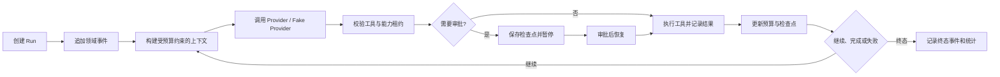
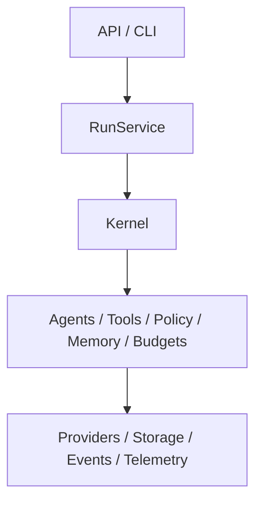

# AgentCell 开发步骤

## 1. 文档目的

本文是对仓库根目录 `AGENTS.md` 的工程化拆解。它把产品目标、架构约束、安全边界和完成标准转换为可按顺序执行、可测试、可交接的开发步骤。

本文不替代 `AGENTS.md`。若两者冲突，以 `AGENTS.md` 为准；每次开始实现前仍须重新检查根目录和目标子目录中的 `AGENTS.md`。

## 2. 分析结论

### 2.1 系统真正的主链路

AgentCell 的主链路不是“模型加聊天界面”，而是以下可恢复执行闭环：



因此，事件、生命周期、预算、权限和检查点必须早于完整 UI 建设；否则暂停恢复、回放、审批和审计会被迫返工。

### 2.2 架构依赖必须单向



执行中必须守住以下边界：

- `kernel` 不依赖 FastAPI、Typer 或前端协议；
- API 和 CLI 只做输入输出适配，不复制业务编排；
- Provider 厂商差异只存在于 Provider 适配器；
- Tool 不直接获取全局数据库会话；
- ORM 模型不越过 Repository 边界；
- SSE 由领域事件映射，不成为新的业务事件源；
- React 只消费稳定 DTO，不复制后端状态机、预算或权限判断。

### 2.3 高风险能力是核心功能，不是收尾项

文件写入、Shell、网络和子 Agent 委派都会扩大影响范围。实现这些能力时必须同时交付：

- 结构化参数和 Pydantic 校验；
- `ToolPolicy`、风险等级和能力租约校验；
- 路径、命令、域名、超时和输出大小限制；
- 审批或拒绝分支；
- 开始、完成、失败和预算事件；
- 幂等性声明及正确的重试策略；
- 对应的单元或集成测试。

不得先实现“能执行”，再把安全和恢复能力留到以后补。

### 2.4 交付单位应是垂直切片

每个阶段都应尽量贯通领域模型、业务实现、存储、一个用户入口、测试和文档。目录按职责逐步生长，不按建议树一次性创建所有实现文件。

首个可运行闭环应使用 Fake Provider，在不消耗线上额度的情况下验证：

```text
创建 Run → 追加事件 → Fake Provider 输出 → 更新预算 → 创建检查点 → 完成 Run
```

在这个闭环稳定后，再接入真实 Provider、危险工具和产品界面。

### 2.5 M1–M4 的实际依赖关系

- M1 建立可运行微内核，是所有后续工作的前置条件。
- M2 在 M1 的生命周期和事件模型上加入安全执行、恢复、记忆与多 Agent。
- M3 只把已稳定的业务能力暴露为 API、SSE、CLI 和 Web 产品界面。
- M4 是扩展生态，不得反向拖慢首版单机闭环。

## 3. 开发总原则

每一步遵循同一工作流：

1. 阅读作用域内的说明、代码、测试和配置；
2. 明确本次变更所属层及允许依赖方向；
3. 定义最小输入、输出、错误、事件和预算边界；
4. 先写或同步写关键测试；
5. 完成最小实现，不提前抽象不存在的第二实现；
6. 运行相关最小测试；
7. 运行 Ruff、Pyright 和完整后端测试；
8. Web 变更另运行类型检查、Vitest、构建及必要的 Playwright 检查；
9. 检查迁移、配置、API 和文档是否同步；
10. 更新 `docs/handoff.md`，准确记录已完成、未完成和风险。

## 4. 分阶段开发步骤

## 阶段 0：工程基线与责任边界

### 目标

让仓库具备清晰、可追踪的工程入口，但不伪装成已经可运行的产品。

### 实施内容

- 建立 `src/agentcell` 包边界及领域子包；
- 建立 `tests`、`migrations`、`web` 和 `docs` 工作区；
- 配置 `pyproject.toml` 中的 Python 3.12、构建、Ruff、Pyright 和 pytest 基线；
- 添加 `.gitignore`、`.env.example` 和不包含明文密钥的 `agentcell.toml` 示例；
- 添加包结构烟雾测试；
- 建立开发步骤和交接文档。

### 验收门槛

- 目录职责与 `AGENTS.md` 的依赖方向一致；
- 不存在空实现、虚假 Provider、虚假 API 或未使用的生产依赖；
- Python 3.12 环境中可以导入 `agentcell` 及其边界包；
- 文档明确说明当前不可运行的部分。

### 当前状态

本轮已完成骨架和文档创建。运行时、数据库、CLI、API 和 Web 应用均尚未实现。

## 阶段 1：领域契约、生命周期与预算

### 目标

先定义整个系统都会依赖的稳定语义，避免各模块自行维护状态字符串和预算算法。

### 实施内容

1. 在 `errors.py` 建立可分类的项目错误层次，但不吞掉原始上下文；
2. 在 `kernel/lifecycle.py` 定义 Run 状态和唯一合法状态转换；
3. 在 `events/models.py` 定义事件信封、版本、时间、Run 内序号和首批 payload；
4. 在 `budgets/models.py` 定义 `Budget`、Usage 与预算快照；
5. 在 `budgets/tracker.py` 实现请求、Token、工具、时间、费用和子 Agent 配额检查；
6. 统一 UUID、UTC 时间、Decimal 费用和序列化约定。

### 必测内容

- 所有合法与非法状态转换；
- 每种预算达到上限、刚好等于上限和超限的行为；
- 子预算不得超过父 Run 剩余额度；
- 事件 payload 的版本化校验和敏感字段脱敏；
- 时间和 Decimal 的稳定序列化。

### 验收门槛

- 其他模块不能直接修改 Run 状态字符串；
- 预算超限返回明确领域错误，不静默截断；
- 领域模型不依赖 FastAPI、Typer 或 SQLAlchemy ORM。

### 当前状态

阶段 1 已于 2026-07-10 完成：项目错误层次、唯一 Run 状态转换表、24 个核心事件名称、版本化事件信封与首批 payload、递归敏感字段脱敏、Budget/Usage/Remaining/Snapshot 模型、请求与工具预留、真实模型 Usage 记账、持续时间和子预算边界均已实现并通过单元测试。下一步进入阶段 2。

## 阶段 2：SQLite、事件存储与迁移

### 目标

建立事件优先、只追加、可并发读取的最小持久化基础。

### 实施内容

1. 加入 SQLAlchemy 2、Alembic 和 aiosqlite；
2. 创建数据库工厂，并在连接初始化时启用 WAL、外键和 5000ms busy timeout；
3. 首个迁移只创建 M1 实际使用的表，优先包含 `runs`、`run_events` 和必要关联；
4. 实现 EventStore/Repository，让其返回领域模型而非 ORM 实例；
5. 使用数据库唯一约束保证 `(run_id, sequence)` 唯一；
6. 明确事务边界，确保状态变更和对应事件不会形成不可解释的半完成状态。

### 必测内容

- 临时数据库初始化和 PRAGMA；
- 同一 Run 事件序号严格递增；
- 历史事件不可更新；
- 并发追加时唯一约束和重试行为；
- Repository 不泄露 ORM 实例；
- Alembic 从空库升级和降级的最小验证。

### 验收门槛

- 生产 Schema 只由 Alembic 变更；
- 测试使用独立临时数据库；
- 大 payload 不直接进入事件表，预留 Artifact 引用语义。

### 当前状态

阶段 2 已于 2026-07-10 完成：异步 SQLite 工厂、WAL/外键/5000ms busy timeout、Run 领域模型、独立 ORM 表、首个 Alembic 迁移、RunRepository、只追加 EventStore、数据库原子 sequence 分配、唯一约束、禁止历史事件 UPDATE/DELETE 的触发器、64 KiB 内联 payload 上限和 Artifact 引用契约均已实现。临时数据库、迁移升降级、事务回滚、外键、payload 往返、超限拒绝和多连接并发追加测试已通过。下一步进入阶段 3。

## 阶段 3：Provider 工程与离线 Fake Provider

### 目标

先稳定统一模型边界，再接入百炼和 DeepSeek 的差异参数。

### 实施内容

1. 定义 `ModelSpec`、模型输出事件、Usage 和分类错误；
2. 定义最小 Provider 接口，以实际的 Fake Provider 和真实适配器需求驱动抽象；
3. 实现确定性 Fake Provider，支持文本、工具调用、流式片段、Usage 和故障注入；
4. 实现 `ProviderFactory`，按 `model_ref` 创建模型，Agent 不判断厂商名称；
5. 接入百炼和 DeepSeek，厂商参数仅保留在对应适配器；
6. 支持注入 HTTPX Client、独立超时、代理、连接池和错误映射；
7. 真实 Provider 测试仅在明确环境开关和密钥存在时运行。

### 必测内容

- Fake Provider 的确定性和故障场景；
- 普通文本、流式、Function Calling、多轮工具、Usage；
- 认证、限流、超时、上游错误和上下文超限分类；
- 仅对允许的 Provider 错误重试；
- API Key、Authorization Header 和完整请求体不进入日志。

### 验收门槛

- 默认测试不访问网络、不消耗线上额度；
- 不发生未记录事件的静默 Provider 降级；
- Agent、Tool、API 中没有厂商条件分支。

### 当前状态

阶段 3 已于 2026-07-10 完成：严格 ModelSpec、AgentCellSettings、统一 Usage/输出事件、Provider 分类错误、重试资格判断、可注入 HTTPX Client、ProviderFactory、百炼与 DeepSeek 官方适配器，以及脚本化 Fake Provider 均已实现。离线契约已覆盖文本、固定流式分片、Function Calling、多轮工具、Usage、故障注入、厂商参数映射和敏感响应体不泄漏；真实 Provider 测试需要 `AGENTCELL_RUN_LIVE_PROVIDER_TESTS=1` 与对应 API Key 同时存在。下一步进入阶段 4。

## 阶段 4：ToolRegistry、能力租约与首批安全工具

### 目标

用一个完整安全路径验证工具注册、参数校验、能力判断、事件和预算更新。

### 实施顺序

1. 定义 `RiskLevel`、`ToolPolicy`、工具调用和工具结果模型；
2. 定义 `CapabilityLease` 及父子租约子集校验；
3. 实现 ToolRegistry 和统一执行器；
4. 首先实现只读的 `workspace.list/read/search`；
5. 实现工作区路径解析、符号链接逃逸防护、敏感路径拒绝和大文件分块；
6. 为工具输出增加字节上限和 Artifact 转存接口；
7. 最后再加入 `workspace.write/patch/delete`、Shell、HTTP 和其他工具。

### 必测内容

- 路径穿越、绝对路径、符号链接逃逸和敏感文件；
- 缺少能力、越权租约和子 Agent 权限扩大；
- 工具参数错误、超时、输出截断和错误分类；
- 非幂等工具绝不自动重试；
- `tool.proposed/started/completed/failed` 与 `budget.updated` 顺序。

### 验收门槛

- 未声明能力默认拒绝；
- Shell 默认关闭且使用参数数组执行；
- 网络默认 HTTPS 白名单，禁止云元数据地址和本机敏感端口；
- 删除和危险命令必须审批或拒绝。

### 当前状态

阶段 4 已于 2026-07-13 完成：RiskLevel、Capability、ToolPolicy、CapabilityLease、父子租约缩权、PolicyEngine、ToolRegistry 和统一 ToolExecutor 均已实现。`workspace.list/read/search` 已形成参数校验、默认拒绝、租约范围、预算预留、事件 Sink、超时、输出字节上限和 Artifact 转存的完整安全路径。临时工作区测试覆盖盘符/UNC/父目录穿越、敏感文件、租约越界、Windows junction 逃逸、二进制文件、UTF-8 分块、有限搜索、超时、异常脱敏和非幂等工具不重试。Shell、网络、写入和删除工具仍未注册，下一步进入阶段 5。

### 危险工具的后续归属

阶段 4 实施顺序中的“最后再加入 `workspace.write/patch/delete`、Shell、HTTP 和其他工具”不表示这些能力应在只读安全切片中直接开放。它们必须等依赖的安全基础完成后再统一实现：

- 阶段 5 保持只读，只验证 RunService、Fake Provider、EventStore、预算和首批安全工具的 M1 闭环；
- 阶段 6 先完成审批持久化、参数修改审批、检查点、暂停恢复和非幂等操作防重放；
- 阶段 7 先完成 Artifact Store，让大型 Diff、命令输出和 HTTP 响应能够外置、恢复和安全引用；
- 随后进入“阶段 7.1：生产工具扩展”，再实现写入、删除、Shell 和 HTTP 工具。

不得为了让阶段 5 功能看起来完整而使用临时布尔值、绕过审批、无限内存输出或无恢复语义的方式提前开放危险工具。

## 阶段 5：RunService 与首个 M1 端到端闭环

### 目标

使用 Fake Provider 和只读工具完成真正可运行、可审计的单 Run 闭环。

### 实施内容

1. 定义无状态 `AgentSpec`、AgentRegistry 和 AgentFactory；
2. 通过 `RunDeps` 注入 Run、工作区、事件、策略、预算和 Agent Registry；
3. 实现 Run 创建、上下文构建、模型调用、工具执行、预算更新和终态；
4. 每个关键状态先形成领域事件，再由存储和输出适配器消费；
5. 每个工具或模型边界都配置超时和分类错误；
6. 实现最小 Typer CLI，直接调用 RunService；
7. 提供 JSON 输出和 Ctrl+C 取消语义。

### 必测内容

- 无工具文本任务完整生命周期；
- 单次和多次只读工具调用；
- 模型失败、工具失败、预算超限和用户取消；
- 事件顺序、终态和统计一致；
- CLI 直接调用服务而非本机 HTTP。

### 验收门槛

- `agentcell run` 可用 Fake Provider 离线完成任务；
- Run 的每个终态都有对应最终事件；
- M1 最小闭环可在进程内重复测试且结果确定。

### 完成情况（2026-07-13）

阶段 5 已完成。当前已实现无状态 `AgentSpec`、`AgentRegistry`、`AgentFactory`、Run 级依赖注入、EventStore 事件 Sink、PydanticAI 模型与工具循环、模型文本增量、预算记账，以及 `completed`、`failed`、`cancelled` 终态。`agentcell run --offline-fake` 可直接调用 RunService 离线执行，支持 `--json`；Ctrl+C 通过任务取消语义进入 `run.cancelled`。集成测试覆盖无工具文本、单次/多次只读工具、Provider 失败、工具失败、请求预算超限、取消和 CLI 持久化。

阶段 5 仍严格保持只读。审批持久化、检查点、恢复、回放和分支属于阶段 6；Artifact Store 属于阶段 7；写入、删除、Shell 和 HTTP 属于阶段 7.1。

## 阶段 6：审批、检查点、恢复、回放与分支

### 目标

把“可恢复”落实为可验证的产品能力，而不是简单重试。

### 实施内容

1. 建立审批领域模型和 `approvals` 表；
2. 对 Guarded/Dangerous 工具生成影响、Diff、剩余预算、幂等性和超时信息；
3. 在等待审批前保存包含消息、预算、未完成工具和父子关系的检查点；
4. 实现批准、拒绝、修改参数后批准和当前 Run 临时同类批准；
5. 实现幂等恢复、取消、历史回放和指定事件序号分支；
6. 防止恢复时重复执行已完成的非幂等工具。

### 必测内容

- 审批暂停后进程重启恢复；
- 批准、拒绝和参数修改分支；
- 相同恢复请求的幂等行为；
- 回放得到相同最终状态；
- 分支只继承指定序号之前的状态；
- 非幂等工具不会重复执行。

### 验收门槛

- `waiting_approval` 和 `paused` 的语义清晰且转换唯一；
- 检查点内容足以恢复，不依赖进程内对象；
- 永久全局批准不作为默认能力。

### 完成情况（2026-07-13）

阶段 6 已完成。审批使用 PydanticAI 原生 `DeferredToolRequests/DeferredToolResults`；`approvals`、`checkpoints` 和 `tool_executions` 由 Alembic revision `20260713_0002` 创建。RunService 支持审批暂停、进程重启后批准/拒绝/修改参数恢复、当前 Run 临时同类批准、幂等取消和重复恢复冲突检测。ReplayService 支持完整/前缀回放与检查点支持的指定 sequence 分支；持久化工具执行账本阻止已开始的非幂等调用在恢复时重复执行。

测试覆盖审批展示字段、重启恢复、三类决定、同类临时授权、重复恢复、回放一致性、分支来源边界和非幂等防重放。阶段 6 没有注册任何写入、删除、Shell 或 HTTP 工具；下一步进入阶段 7 的记忆、上下文压缩与 Artifact。

## 阶段 7：记忆、上下文压缩与 Artifact

### 目标

在不引入向量数据库的前提下，让长任务和历史任务可持续运行。

### 实施内容

1. 实现 Working、Conversation、Episodic、Semantic 四层记忆模型；
2. 使用 SQLite FTS5、BM25、时间衰减、重要度和作用域评分；
3. 实现 Memory Policy、去重、过期、敏感信息处理和必要审批；
4. 实现 `PairSafeTrimmer`，保证工具调用和工具结果成对保留；
5. 实现 `ToolOutputCompactor`、`EpisodicSummarizer` 和 `MemoryInjector`；
6. 实现 Artifact Store，并让大型工具输出只通过摘要和引用进入上下文；
7. 为摘要使用低成本、低温度、关闭深度思考的模型配置。

### 必测内容

- FTS5 检索排序和作用域隔离；
- 记忆去重、过期、编辑和删除；
- 工具调用/结果配对裁剪；
- 大输出转 Artifact 后可恢复加载；
- 压缩前后关键任务状态不丢失。

### 完成情况（2026-07-13）

阶段 7 已完成。新增 Working、Conversation、Episodic、Semantic 四层领域模型和作用域安全的 `MemoryService`；Alembic revision `20260713_0003` 创建 `memory_items`、`memory_fts`、同步触发器及 `artifacts`。检索综合 FTS5 BM25、30 天半衰期、重要度、标签和用户/项目/Agent 作用域，写入经过凭据拒绝、Semantic 显式批准、去重和过期策略。

运行时已接入 `MemoryInjector → PairSafeTrimmer → ToolOutputCompactor`，召回和压缩形成领域事件；`EpisodicSummarizer` 强制使用独立、低温度、关闭深度思考的模型配置。文件 Artifact Store 提供大小上限、受控路径、原子写入、内容去重、SHA-256/字节数加载校验，并把消息中的 Artifact UUID 保存进检查点。测试覆盖检索排序与隔离、CRUD/过期/策略、成对裁剪、运行时召回事件、大输出外置、篡改检测及进程重启后恢复加载。

阶段 7 仍未注册写入、删除、Shell 或 HTTP 工具；下一步进入阶段 7.1 的生产工具扩展。

## 阶段 7.1：生产工具扩展

### 前置条件

只有同时满足以下条件才开始本阶段：

- 阶段 6 的审批、检查点、暂停恢复和非幂等防重放测试已经通过；
- 阶段 7 的 Artifact Store 已可持久化、加载、校验哈希并随检查点恢复；
- ToolExecutor 仍是参数、能力、预算、事件、超时和输出限制的唯一执行入口。

### 实施内容

1. 实现 `workspace.write` 和 `workspace.patch`：写入前生成 Diff，使用工作区路径与 `filesystem.write` 租约校验，并默认要求审批；
2. 实现 `workspace.delete`：标记为 DANGEROUS 和非幂等，必须审批，恢复时不得重复删除；
3. 实现 `shell.run/test`：默认关闭，只接受参数数组和命令白名单，限制 cwd、环境变量、超时和输出大小，禁止 `shell=True`；
4. 实现 `http.request`：只允许 HTTPS 白名单，DNS 解析后的所有地址必须再次检查，重定向逐跳复核，禁止本机、私网、链路本地和云元数据地址；
5. 对 POST、PUT、PATCH、DELETE 等非只读 HTTP 方法默认要求审批，并禁止非幂等自动重试；
6. 将大型 Diff、Shell 输出和 HTTP 响应写入 Artifact，事件和模型上下文只保留摘要与引用；
7. 为每次危险操作保存审批关联、参数摘要、能力租约、预算、事件和检查点信息。

### 必测内容

- 写入和补丁的路径穿越、symlink/junction 逃逸、敏感路径和审批 Diff；
- 删除批准、拒绝、取消、恢复和非幂等防重放；
- Shell 参数注入、命令白名单、环境泄漏、超时、输出超限和 Ctrl+C；
- HTTP DNS rebinding、重定向绕过、IPv4/IPv6 私网、元数据地址、响应超限和非只读审批；
- 大输出转 Artifact 后能够恢复加载，且事件、日志和模型上下文不包含完整敏感内容；
- 子 Agent 不能通过生产工具扩大父 Run 的文件、命令或网络权限。

### 验收门槛

- 不存在绕过 ToolExecutor、CapabilityLease 或审批服务的生产工具调用路径；
- 写入、删除、Shell 和非只读网络操作在未获得有效审批时无法执行；
- 进程重启恢复不会重复执行已经完成的非幂等操作；
- Shell 仍明确属于进程级约束，不宣称具备强沙箱隔离。

### 完成情况（2026-07-13）

阶段 7.1 已完成。`workspace.write/patch/delete` 使用统一路径解析、读写双作用域、敏感路径拒绝、symlink/junction 防护、审批前 unified Diff、`expected_sha256` 并发保护和原子写入；删除保持 DANGEROUS、非幂等且受持久化执行账本保护。大型 Diff 保存为 Artifact，并将引用纳入审批和检查点。

`shell.run/test` 只接受命令名和参数数组，使用清洗后的绝对 PATH 解析、工作区 cwd、环境白名单、进程超时和合并输出上限，不使用 `shell=True`；两者均按非幂等危险工具处理。`http.request` 只允许经过租约批准的 HTTPS 443，逐跳检查域名、全部 DNS 地址、固定连接 IP、Host/TLS SNI、真实 peer、重定向、请求头、敏感 query、请求/响应大小，并禁用环境代理。当前对所有 HTTP 方法采取更严格的逐次审批和非幂等策略。

测试覆盖批准前不执行、Diff 重启恢复、哈希冲突、创建/补丁/删除、junction 逃逸、命令白名单、argv 注入、环境泄漏、输出超限/Artifact、私网 DNS、DNS 固定、子域重定向、敏感参数、响应上限和大型 Diff 检查点引用。下一步进入阶段 8 的多 Agent 协作与预算继承。

## 阶段 8：多 Agent 协作与预算继承

### 目标

在父 Run 可控的权限和预算内实现 Agent as Tool 与程序化 Handoff。

### 实施内容

1. 实现 coordinator、coder、reviewer、researcher、summarizer 配置；
2. reviewer 默认只读；
3. 实现 Agent as Tool 的结构化请求和结果；
4. 实现 Coordinator → Coder → Reviewer → Finalizer 的程序化切换；
5. 从父 Run 剩余额度分配请求、Token、工具、费用、时长、子 Agent 数和深度；
6. 记录父子 Run、Trace、事件和检查点关联；
7. 禁止子 Agent 权限或预算超过父 Agent。

### 必测内容

- 最大深度、最大子 Agent 数和预算耗尽；
- 子租约严格为父租约子集；
- reviewer 无法写文件；
- 子 Agent 失败、取消和超时能正确回传父 Run；
- 父子事件和 Trace 关联稳定。

## 阶段 9：FastAPI、AG-UI/SSE 与 CLI 完整化

### 目标

将稳定的 RunService 能力暴露为产品接口，不在适配层复制业务逻辑。

### 实施内容

1. 创建 FastAPI 应用工厂、依赖注入和统一错误模型；
2. 实现 Runs、Agents、Memories、Providers、Tools、Health 和 Version 路由；
3. 将领域事件映射为 AG-UI/SSE；
4. 使用事件序号支持 SSE 断线续传；
5. 对 resume、branch、cancel 定义幂等或冲突语义；
6. 完整实现 CLI 的 inspect、replay、branch、cancel、agents、tools 和 memory；
7. 确保敏感配置不通过 API 返回。

### 必测内容

- API Schema 和统一错误；
- SSE 顺序、重连和终态；
- 路由不包含业务编排；
- CLI JSON 输出和退出码；
- API/CLI 与 RunService 的集成行为一致。

## 阶段 10：React Web 工作台

### 目标

构建企业级 AI 软件项目执行工作台，完整呈现状态、审批、时间线和预算反馈。

### 实施顺序

1. 初始化 Vite、React、TypeScript 严格模式、pnpm、Vitest 和 Playwright；
2. 检查并优先复用 `src/components`、`src/components/ui`、`src/components/common`、`src/features` 和 Storybook；
3. 建立稳定 DTO 与 API Client，服务端状态统一使用 TanStack Query；
4. 实现 SSE 连接、按 sequence 恢复和断线状态反馈；
5. 先实现任务工作台、运行时间线和审批中心；
6. 再实现 Agent、记忆、Provider、模型和成本预算页面；
7. 使用 Badge、Progress、Timeline、Stepper 和异常行高亮表达状态；
8. 安全渲染 Markdown、代码和 Diff，防止 XSS；
9. 长列表使用分页或虚拟化，API Key 不进入 localStorage。

### 视觉与交互验收

- 浅色冷调分层背景，关键区域可使用克制的深色或渐变；
- 主卡、次级卡和状态卡有明确层级；
- Agent 流程使用时间线或节点流；
- 审批操作有 loading、成功、失败和取消反馈；
- Playwright 检查溢出、重叠、可见性、响应式和控制台错误；
- 类型检查、Vitest 和生产构建通过。

## 阶段 11：可观测性、安全加固与交付

### 目标

完成生产可诊断性、默认安全边界和单体部署闭环。

### 实施内容

1. 确定且只保留一套结构化日志方案；
2. 接入 OpenTelemetry，覆盖 Provider、工具、HTTP 和父子 Agent；
3. 日志包含 trace/run/conversation/agent/provider/model/event 标识；
4. 验证日志、异常、事件和 Artifact 不泄露密钥或敏感参数；
5. 建立超时、重试、熔断、输出大小和存储配额；
6. 完成 Dockerfile、compose、静态前端托管和单 SQLite 文件部署；
7. 完整运行迁移、后端检查、前端检查和 E2E；
8. 更新 README、配置、CLI、API、Toolset、权限和部署文档。

### 验收门槛

- 一个 Python 服务、一个 SQLite 文件、一个静态前端目录和一个工作区即可部署；
- Shell 强隔离不被虚假承诺，文档明确首版边界；
- 没有 API Key、Authorization Header、完整环境变量或原始思维链进入日志；
- 完成定义中的自动化检查全部真实通过。

## 阶段 12：M4 扩展生态

仅在 M1–M3 稳定后按真实需求推进：

- MCP Client；
- 新 Provider；
- Embedding Retriever；
- PostgreSQL Adapter；
- 强隔离 Sandbox；
- 多用户认证；
- 固定工作流 Graph。

每项扩展都必须重新回答 `AGENTS.md` 的八个架构判断问题，不能扩大默认权限或破坏单体部署能力。

## 5. 推荐的前三个开发迭代

### 迭代 1：可验证领域基础

- Run 生命周期；
- Budget/Usage；
- 事件模型；
- 单元测试；
- 错误与 UTC/UUID/Decimal 约定。

完成后应能纯内存地验证状态和预算规则。

### 迭代 2：事件持久化

- SQLite 初始化；
- 首个 Alembic 迁移；
- runs/run_events Repository；
- 事件序号和只追加保证；
- 临时数据库集成测试。

完成后应能创建 Run、追加并读取稳定事件流。

### 迭代 3：Fake Provider 运行闭环

- ModelSpec 和 ProviderFactory；
- Fake Provider；
- 最小 AgentSpec/Registry；
- RunService；
- 最小 CLI；
- 生命周期、事件、预算和失败集成测试。

完成后应能离线运行一个任务，并得到确定的事件序列与最终状态。

## 6. 跨阶段质量门禁

每次合并前至少检查：

- [ ] 变更符合允许的依赖方向；
- [ ] 公共 Python 函数有类型标注并使用 `from __future__ import annotations`；
- [ ] TypeScript 严格模式下没有无理由的 `any`；
- [ ] 状态机、预算、审批和恢复变更有自动化测试；
- [ ] 危险操作有能力检查、审批、超时、输出限制和事件；
- [ ] 非幂等操作没有自动重试；
- [ ] 大内容通过 Artifact 引用而非直接进入事件或模型上下文；
- [ ] 数据库变更有 Alembic 迁移；
- [ ] Provider 真实测试默认关闭；
- [ ] Ruff、格式检查、Pyright 和 pytest 通过；
- [ ] 前端类型检查、测试、构建及必要 E2E 通过；
- [ ] 配置、API、CLI、Toolset、权限或环境变量变更已更新文档；
- [ ] `docs/handoff.md` 反映真实状态，不伪造完成度。

## 7. 当前已知风险与待确认决策

1. 当前 PowerShell 的默认 Python 为 3.10.9，但项目已由 uv 创建 Python 3.12.11 环境；后续必须使用 `uv run` 或显式选择 3.12，不能直接用默认 `python` 执行项目检查。
2. 百炼与 DeepSeek 的模型协议、思考参数和 Usage 字段已在阶段 3 按 2026-07-10 官方文档验证；升级 PydanticAI 或切换模型版本时必须重新执行离线参数映射与显式在线契约测试。
3. AG-UI 的具体版本和事件映射需在 API 阶段固定，并用契约测试锁定。
4. 结构化日志应在实现前决定使用 `structlog` 或标准库 logging，项目内只保留一种。
5. Shell 首版只有进程级约束，不等同于强沙箱；部署文档必须明确风险。
6. SQLite 并发追加事件的事务策略需要通过压力测试验证，不能只依赖应用层序号计算。

## 8. 完成定义

一个阶段只有在功能、错误处理、安全、预算、事件、恢复、迁移、测试、静态检查和文档同时满足其验收门槛后才算完成。目录存在、接口留有 TODO、手工演示成功或单个测试通过，都不能替代该阶段的完成定义。
