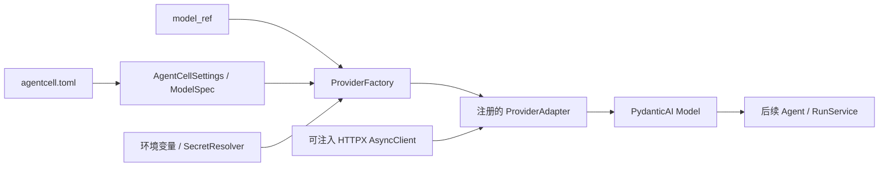

# AgentCell Provider 工程

## 1. 实现范围

阶段 3 已建立统一模型边界，并接入以下实现：

- 阿里云百炼（Alibaba Cloud Model Studio）`qwen3.7-plus`；
- DeepSeek 官方平台 `deepseek-v4-pro`；
- 完全离线、可脚本化的 Fake Provider；
- 可注入的 HTTPX AsyncClient、逐模型超时、代理环境变量和连接池；
- 统一 Usage、模型输出事件、错误分类和重试判断；
- 默认禁网、显式付费开关控制的 Provider 契约测试。

阶段 3 只负责稳定 Provider 边界，不实现 RunService、Agent Registry、工具执行、审批或 CLI 运行闭环。

## 2. 依赖与调用方向



调用方只提交稳定的 `model_ref`。`ProviderFactory` 从配置中取得 `ModelSpec`，通过注册表选择适配器；Agent、Tool、API 和 CLI 不需要也不允许判断厂商名称。

`ProviderAdapter` 只构造 PydanticAI 的 `Model`。AgentCell 不重复实现 OpenAI 兼容协议、Function Calling 或底层流式解析。

## 3. 配置模型

公共字段由 `ModelSpec` 定义：模型名、最大输出 Token、温度、超时、最大重试次数和 HTTP 连接池。联网 Provider 还必须给出 `api_key_env`，这里只保存环境变量名，不保存密钥值。

厂商专属字段由专属 Schema 和适配器解释：

| Provider | 专属字段 | 请求映射 |
| --- | --- | --- |
| 百炼 | `thinking`、`thinking_budget`、区域 `base_url` | OpenAI-compatible `extra_body.enable_thinking` 与 `extra_body.thinking_budget` |
| DeepSeek | `thinking`、`reasoning_effort` | `extra_body.thinking.type` 与 `reasoning_effort` |
| Fake | 注册的 `FakeScript` | 不读取密钥、不创建 HTTP Client、不访问网络 |

示例：

```toml
[models.qwen_plus]
provider = "bailian"
model = "qwen3.7-plus"
api_key_env = "DASHSCOPE_API_KEY"
base_url = "https://dashscope.aliyuncs.com/compatible-mode/v1"
thinking = true
thinking_budget = 12000
max_output_tokens = 16000
timeout_seconds = 120
max_retries = 3

[models.deepseek_pro]
provider = "deepseek"
model = "deepseek-v4-pro"
api_key_env = "DEEPSEEK_API_KEY"
thinking = true
reasoning_effort = "high"
max_output_tokens = 16000
timeout_seconds = 120
max_retries = 3
```

百炼 API Key 具有区域属性，部署到其他区域时必须把 `base_url` 改成对应区域的官方端点。DeepSeek 适配器固定使用 PydanticAI `DeepSeekProvider` 的官方 API 端点，不提供静默代理或厂商降级。

## 4. 模型设置依据

本实现于 2026-07-10 对照当时官方资料确认：

- PydanticAI 的 `OpenAIChatModel` 可搭配 `AlibabaProvider`、`DeepSeekProvider` 和自定义 HTTPX Client；
- 百炼 OpenAI-compatible Chat API 用 `extra_body` 传递 `enable_thinking` 和 `thinking_budget`；
- `qwen3.7-plus` 支持混合思考模式；
- DeepSeek V4 用 `thinking.type` 开关思考模式，只接受 `high` 或 `max` 作为原生推理强度；
- DeepSeek 思考模式不使用 temperature、top_p、presence_penalty 或 frequency_penalty，本项目在配置期拒绝思考模式下的 temperature；
- 两家 Provider 的 Usage 统一通过 PydanticAI `RequestUsage` / `RunUsage` 转换，不在 Agent 代码中解析厂商响应字段。

官方资料：

- [PydanticAI OpenAI-compatible models](https://pydantic.dev/docs/ai/models/openai/)
- [PydanticAI model testing](https://pydantic.dev/docs/ai/guides/testing/)
- [阿里云百炼深度思考](https://www.alibabacloud.com/help/en/model-studio/deep-thinking)
- [阿里云百炼 OpenAI-compatible Chat API](https://www.alibabacloud.com/help/en/model-studio/qwen-api-via-openai-chat-completions)
- [DeepSeek 首次 API 调用](https://api-docs.deepseek.com/)
- [DeepSeek Thinking Mode](https://api-docs.deepseek.com/guides/thinking_mode)
- [DeepSeek Chat Completion 参数](https://api-docs.deepseek.com/api/create-chat-completion)

## 5. Fake Provider

`FakeScript` 是不可变步骤序列，每次构造模型都会获得独立游标。支持：

- `FakeTextStep`：固定文本、可选固定流式分片和非流式 Usage；
- `FakeToolCallStep`：固定工具名、结构化参数、调用 ID 和 Usage；
- `FakeFailureStep`：认证、权限、限流、超时、连接、上下文、上游和协议故障；
- 多步骤脚本：验证多轮工具调用和最终回答。

非流式 Usage 使用脚本中的明确数值；流式路径由 PydanticAI `FunctionModel` 对固定分片进行确定性 Usage 估算。Fake Provider 不伪装真实厂商，不允许回退到网络模型。

## 6. 错误与重试

Provider 响应会被转换为 AgentCell 的安全异常。异常只保留 Provider、模型名、状态码和通用说明，不保留响应体、请求头、API Key 或完整请求内容。

| 场景 | 错误 | 默认可重试 |
| --- | --- | --- |
| 401 | `ProviderAuthenticationError` | 否 |
| 403 | `ProviderPermissionError` | 否 |
| 404 / 无效模型或端点 | `ProviderModelNotFoundError` | 否 |
| 上下文超限 | `ProviderContextLimitError` | 否 |
| 429 | `ProviderRateLimitError` | 是 |
| 连接失败、读取超时 | `ProviderConnectionError` / `ProviderTimeoutError` | 是 |
| 502、503、504 | 上游错误或超时 | 是 |
| 其他 5xx | `ProviderUpstreamError` | 否 |
| 无效参数或异常响应 | `ProviderProtocolError` | 否 |

`should_retry_provider_error` 只回答“该错误在剩余次数内是否允许重试”。真正的重试、退避、预算预留和 `model.failed` / `budget.updated` 事件必须由后续 RunService 统一编排，ProviderFactory 不会自行重试或静默切换模型。

## 7. HTTP 与密钥生命周期

- 调用方可注入共享 `httpx.AsyncClient`；注入的 Client 始终由调用方关闭；
- 未注入时，ProviderFactory 为模型创建具有独立超时和连接池的 Client，并在 `aclose()` 时关闭；
- `trust_env=False`，不会隐式继承系统代理；需要代理时只在 `http.proxy_env` 中声明环境变量名；
- 仅解析配置明确引用的环境变量，不读取或传递完整环境；
- 不跟随 HTTP 重定向，不记录 Authorization Header。

## 8. 测试与真实调用开关

默认契约测试将 PydanticAI 的 `ALLOW_MODEL_REQUESTS` 设为 `False`。真实测试只有同时存在明确开关和对应 API Key 时才运行：

```powershell
$env:AGENTCELL_RUN_LIVE_PROVIDER_TESTS="1"
$env:DASHSCOPE_API_KEY="..."
$env:DEEPSEEK_API_KEY="..."
uv run pytest tests/provider_contract/test_live_providers.py
```

仅配置 API Key 不会发起真实请求。CI 默认不得打开该开关。
