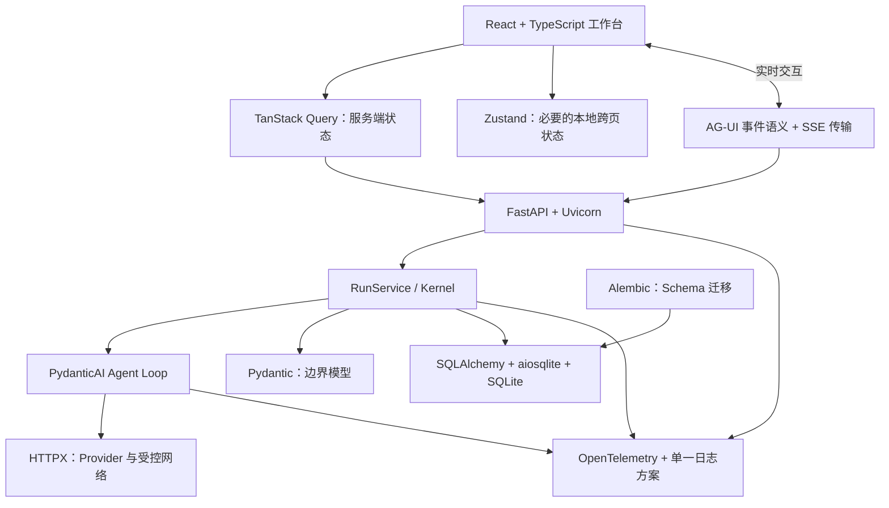

# AgentCell 技术栈与项目职责

## 1. 文档目的

本文解释 `AGENTS.md` 中列出的前后端技术为什么存在、在 AgentCell 中承担什么职责，以及它们不能越过哪些架构边界。

本文描述的是技术选型和使用约束，不代表所有依赖都已经安装。实际依赖状态以根目录 `pyproject.toml`、`uv.lock`、未来的 `web/package.json` 和 `pnpm-lock.yaml` 为准。

状态说明：

- **已接入**：已经出现在当前依赖、源码或测试中；
- **下一阶段**：近期垂直切片会实际使用；
- **后续阶段**：架构已确定，但尚未安装或实现；
- **按需**：只有出现明确场景时才引入；
- **待决策**：候选方案只能选择一个，决定前不能同时接入。

## 2. 技术在整体架构中的位置



最重要的边界是：

- FastAPI、CLI 和 React 都是适配层，不拥有 Run 状态机；
- PydanticAI 提供模型调用和 Agent Loop 基础能力，AgentCell 负责事件、预算、审批、恢复和权限；
- AG-UI/SSE 是领域事件的产品映射，不是新的领域事件源；
- SQLAlchemy ORM 只存在于 storage，不能替代领域模型；
- OpenTelemetry 和日志用于技术诊断，不能替代 SQLite 中的业务事件。

## 3. 后端运行时与依赖管理

| 技术 | 当前状态 | 在 AgentCell 中的作用 | 使用边界 | 官方资料 |
| --- | --- | --- | --- | --- |
| Python 3.12+ | 已接入 | 后端、CLI、API、测试和迁移的统一运行语言；允许使用现代类型语法、`asyncio`、`StrEnum` 等能力。 | 默认 PowerShell Python 可能不是 3.12，项目命令统一通过 `uv run` 执行；异步路径禁止混入阻塞 I/O。 | [Python 3.12 文档](https://docs.python.org/3.12/) |
| uv | 已接入 | 管理 Python、虚拟环境、`pyproject.toml` 依赖、开发依赖组和 `uv.lock`；保证本地与 CI 使用相同解析结果。 | 使用 `uv add/remove` 修改依赖，提交 `uv.lock`；不同时维护另一套手写 requirements 作为事实来源。 | [uv 文档](https://docs.astral.sh/uv/)、[锁定与同步](https://docs.astral.sh/uv/concepts/projects/sync/) |

项目中的典型命令：

```powershell
uv sync --python 3.12 --dev
uv lock --check
uv run python -m pytest
```

新增依赖必须随实际代码切片引入，不能为了“以后会用”一次性安装全部技术栈。

## 4. API、模型与数据边界

| 技术 | 当前状态 | 在 AgentCell 中的作用 | 使用边界 | 官方资料 |
| --- | --- | --- | --- | --- |
| FastAPI | 后续阶段 | 暴露 Runs、Agents、Memories、Tools、Health 等 HTTP API，负责参数解析、依赖注入、OpenAPI 和统一错误响应。 | 路由不得编排业务流程；必须调用 RunService，不能直接操作 ORM、预算或状态字符串。 | [FastAPI 文档](https://fastapi.tiangolo.com/) |
| Uvicorn | 后续阶段 | 作为 ASGI Server 运行 FastAPI，承载 HTTP、SSE 和应用生命周期。 | 它是进程/协议服务器，不是业务框架；超时、代理头、监听地址和 worker 策略必须通过部署配置管理。 | [Uvicorn 文档](https://www.uvicorn.org/) |
| `pydantic-ai-slim` | 已接入 | 提供模型调用、Agent Loop、Function Calling、工具参数校验、流式模型事件、结构化结果、基础重试、Usage 和委派基础能力。使用 slim 版本控制不需要的 Provider 依赖。 | 不重复实现其模型协议；AgentCell 仍负责 Run 生命周期、事件、预算、审批、恢复、记忆和 Provider 工程。Provider 专有参数不能泄露到 Agent 代码。 | [PydanticAI 安装](https://pydantic.dev/docs/ai/overview/install/) |
| Pydantic v2 | 已接入 | 表达领域事件、Run、预算、Provider 配置、工具参数、API DTO 和持久化 JSON Schema；统一验证、序列化、UUID、UTC 和 Decimal。 | ORM 模型不能冒充领域模型；跨边界数据禁止无约束 `dict` 和静默额外字段。 | [Pydantic 文档](https://pydantic.dev/docs/validation/latest/) |
| pydantic-settings | 已接入 | 从环境变量和配置文件加载应用、Provider、模型、数据库和安全配置，并生成可验证的 Settings。 | API Key 只能从环境变量或 Secret Resolver 读取；不得返回给 API、写入数据库或放入模型上下文。 | [Settings Management](https://pydantic.dev/docs/validation/latest/concepts/pydantic_settings/) |
| HTTPX | 已接入 | 为百炼、DeepSeek 和受控 HTTP Tool 提供同步/异步 HTTP Client、连接池、代理、超时和流式响应。 | Client 必须可注入；Provider 与网络工具使用独立超时和域名策略；不记录 Authorization Header；不在每次请求中随意新建 Client。 | [HTTPX 文档](https://www.python-httpx.org/) |

### Pydantic 与 PydanticAI 的区别

- Pydantic 负责“数据是否有效、如何序列化”；
- PydanticAI 负责“如何与模型交互并运行基础 Agent Loop”；
- AgentCell 负责“这次运行是否允许、还剩多少预算、如何记录事件、何时暂停、怎样恢复”。

三者不能互相替代。

## 5. 数据库与持久化

| 技术 | 当前状态 | 在 AgentCell 中的作用 | 使用边界 | 官方资料 |
| --- | --- | --- | --- | --- |
| SQLite | 已接入 | 首版唯一数据库文件，保存 Runs、领域事件、消息、审批、记忆、Artifacts 和检查点；未来使用 FTS5 完成长记忆检索。 | 保持单机单文件；启用 WAL、外键和 busy timeout；不把它包装成伪分布式数据库。大型二进制内容优先外置为 Artifact。 | [SQLite 文档](https://www.sqlite.org/docs.html) |
| SQLAlchemy 2 | 已接入 | 提供异步 Engine/Session、事务、SQL 表达式和 ORM 映射，隔离业务层与 SQLite 实现。 | storage 返回领域模型；ORM 实例不得进入 kernel、API 或前端 DTO；AsyncSession 不在并发任务间共享。 | [SQLAlchemy asyncio](https://docs.sqlalchemy.org/en/20/orm/extensions/asyncio.html) |
| Alembic | 已接入 | 维护可审查、可升级和可降级的数据库 Schema 历史，并检查 ORM metadata 与迁移是否漂移。 | 所有生产 Schema 变更必须通过迁移；应用启动不得调用 `metadata.create_all()` 临时改变生产表。 | [Alembic 文档](https://alembic.sqlalchemy.org/en/latest/) |
| aiosqlite | 已接入 | 为 SQLAlchemy 的 SQLite 方言提供 asyncio 驱动，使数据库调用不阻塞 AgentCell 的事件循环。 | 它不改变 SQLite 的单写者特性；并发正确性仍依赖事务、WAL、busy timeout、唯一约束和重试边界。 | [aiosqlite 文档](https://aiosqlite.omnilib.dev/en/stable/) |

四者的关系：

```text
领域模型
   ↓ Repository 转换
SQLAlchemy AsyncSession
   ↓ aiosqlite 驱动
SQLite 数据库文件

Alembic ──负责──> SQLite Schema 的版本演进
```

## 6. CLI、重试与可观测性

| 技术 | 当前状态 | 在 AgentCell 中的作用 | 使用边界 | 官方资料 |
| --- | --- | --- | --- | --- |
| Typer | 后续阶段 | 构建 `agentcell run/chat/serve/inspect/replay/branch` 等类型化 CLI 命令。 | CLI 直接调用 RunService，不通过 HTTP 调用本机 FastAPI；命令必须返回有意义的退出码。 | [Typer 文档](https://typer.tiangolo.com/) |
| Rich | 后续阶段 | 展示流式文本、表格、Diff、审批、进度、错误和 JSON 之外的人类可读 CLI 输出。 | 只负责终端渲染，不在 Rich 组件中保存业务状态；`--json` 模式不得混入装饰文本。 | [Rich 文档](https://rich.readthedocs.io/en/stable/) |
| Tenacity | 按需 | 仅在 PydanticAI 未覆盖的边界为幂等操作提供退避、停止条件和重试回调。 | 不作为全局“自动重试一切”的装饰器；401/403、参数错误、上下文超限及非幂等工具默认不重试。 | [Tenacity 文档](https://tenacity.readthedocs.io/en/latest/) |
| OpenTelemetry | 后续阶段 | 记录 Provider 延迟、首 Token 时间、工具耗时、重试、HTTP 请求和父子 Agent Trace。 | Span 是技术追踪，不是业务审计；不得记录密钥、完整敏感参数或原始思维链。 | [OpenTelemetry Python](https://opentelemetry.io/docs/languages/python/) |
| structlog | 待决策 | 候选结构化日志方案，便于绑定 `trace_id/run_id/agent_id/provider/model/event_type` 和统一处理器。 | 若选择 structlog，项目业务代码不再并行维护另一套标准库格式化约定。 | [structlog 文档](https://www.structlog.org/en/stable/) |
| 标准库 logging | 待决策 | 零额外依赖的候选日志方案，可通过 Adapter、Filter、Formatter 或 LogRecord factory 实现结构化上下文。 | 与 structlog 二选一；决定后项目只保留一套日志调用规范。 | [Python logging](https://docs.python.org/3/library/logging.html) |

日志方案应在首次实现 `telemetry/logging.py` 前作出决定。选择标准是结构化上下文、异步安全、第三方日志兼容性和依赖成本，而不是同时安装两套后再观察。

## 7. 后端质量工具

| 技术 | 当前状态 | 在 AgentCell 中的作用 | 使用边界 | 官方资料 |
| --- | --- | --- | --- | --- |
| pytest | 已接入 | 承载领域单元测试、SQLite 集成测试、Provider 契约测试、回放测试和后续 CLI/API 测试。 | 真实 Provider 测试默认关闭；测试不得依赖执行顺序或共享生产数据库。 | [pytest 文档](https://docs.pytest.org/en/stable/) |
| pytest-asyncio | 已接入 | 让测试函数和 fixture 可以 `await` 异步数据库、Provider、工具和 RunService。 | 每个测试明确事件循环与资源生命周期；AsyncSession/HTTP Client 测试结束后必须关闭。 | [pytest-asyncio 文档](https://pytest-asyncio.readthedocs.io/en/stable/) |
| Ruff | 已接入 | 同时负责 Python lint、导入顺序和格式检查，减少多套格式工具。 | 配置集中在 `pyproject.toml`；不能通过关闭安全规则来掩盖真实问题。 | [Ruff 文档](https://docs.astral.sh/ruff/) |
| Pyright | 已接入 | 以 strict 模式检查公共接口、Pydantic/SQLAlchemy 类型、异步边界和测试类型。 | 不使用无说明的 `Any`、`type: ignore` 或无类型公共函数绕过设计问题。 | [Pyright 文档](https://microsoft.github.io/pyright/) |

后端完成检查：

```powershell
uv lock --check
uv run ruff check .
uv run ruff format --check .
uv run pyright
uv run python -m pytest
uv run alembic check
```

## 8. 前端基础技术

当前 `web/` 尚未初始化，以下技术均属于后续产品接口阶段。版本应在真正初始化时依据兼容性确定并写入 `package.json` 与 `pnpm-lock.yaml`。

| 技术 | 当前状态 | 在 AgentCell 中的作用 | 使用边界 | 官方资料 |
| --- | --- | --- | --- | --- |
| React | 后续阶段 | 以组件组合方式实现任务工作台、审批中心、运行时间线、Agent/记忆/Provider 管理和成本视图。 | 页面优先组合已有组件；React 组件不复制后端状态机、预算或权限决策。 | [React 文档](https://react.dev/) |
| TypeScript | 后续阶段 | 为 API DTO、AG-UI/SSE 事件、组件 Props、查询结果和本地状态提供静态类型。 | 开启 strict；禁止无理由 `any`；DTO 集中定义或由 OpenAPI 生成，不能依赖 ORM 字段。 | [TypeScript 文档](https://www.typescriptlang.org/docs/) |
| Vite | 后续阶段 | 提供前端开发服务器、React/TypeScript 构建和静态生产产物。 | 只负责构建和开发体验，不承担服务端业务；最终产物由单个 Python 服务托管。 | [Vite 指南](https://vite.dev/guide/) |
| pnpm | 后续阶段 | 管理前端依赖、脚本和锁文件，提供可重复安装。 | `pnpm-lock.yaml` 应提交；不得与 npm/yarn 锁文件并存；依赖只在 `web/` 工作区管理。 | [pnpm 文档](https://pnpm.io/) |

## 9. 前端状态、实时协议与测试

| 技术 | 当前状态 | 在 AgentCell 中的作用 | 使用边界 | 官方资料 |
| --- | --- | --- | --- | --- |
| TanStack Query | 后续阶段 | 管理 Runs、Agents、Memories、Providers 等服务端状态的请求、缓存、失效、重试、loading/error 和取消。 | 服务端数据不复制进 Zustand；请求重试必须尊重操作幂等性，审批和写操作不能盲目自动重试。 | [TanStack Query 文档](https://tanstack.com/query/latest/docs/framework/react/overview) |
| Zustand | 按需 | 仅保存确有必要的跨页面本地状态，例如界面偏好、临时面板选择或不属于服务端的交互状态。 | Run、预算、审批、Provider 和记忆数据归 TanStack Query/SSE；不在 localStorage 中保存 API Key。没有真实跨页需求时不引入。 | [Zustand 文档](https://zustand.docs.pmnd.rs/)、[官方仓库](https://github.com/pmndrs/zustand) |
| AG-UI | 后续阶段 | 作为 Agent 与用户界面之间的开放事件协议，表达文本增量、工具、审批、中断、状态和子 Agent 等实时交互。 | AgentCell 领域事件先持久化，再映射为 AG-UI；不能让协议事件直接修改数据库状态。不要暴露原始思维链。 | [AG-UI 文档](https://docs.ag-ui.com/introduction)、[协议仓库](https://github.com/ag-ui-protocol/ag-ui) |
| SSE | 后续阶段 | 作为服务器到浏览器的单向实时传输，承载 AG-UI 映射后的增量事件，并通过 sequence/Last-Event-ID 续传。 | SSE 是传输方式，不是事件 Schema；审批、取消、恢复等客户端命令仍通过 HTTP POST。首版不为普通流式输出引入 WebSocket。 | [MDN Server-Sent Events](https://developer.mozilla.org/en-US/docs/Web/API/Server-sent_events) |
| Vitest | 后续阶段 | 运行前端工具函数、hooks、状态映射和组件行为的快速单元/组件测试，并复用 Vite 配置。 | 不用组件单测替代用户关键路径 E2E；涉及时间和流式事件时使用确定性 fixture。 | [Vitest 指南](https://vitest.dev/guide/) |
| Playwright | 后续阶段 | 验证创建任务、流式输出、工具审批、时间线、取消、恢复和记忆等浏览器 E2E，并检查布局与控制台错误。 | E2E 使用隔离数据库和 Fake Provider；不得默认调用真实模型或复用生产数据。 | [Playwright 文档](https://playwright.dev/docs/intro) |

### TanStack Query 与 Zustand 的分工

```text
后端可重新获取的数据
    → TanStack Query

SSE 到达的 Run 增量
    → 更新 Query Cache 或专用事件投影

纯界面、跨页面且服务端不关心的状态
    → 必要时使用 Zustand
```

如果一个状态能通过 API 或事件流恢复，它通常不应该只保存在 Zustand。

### AG-UI 与 SSE 的分工

```text
AgentCell DomainEvent
    → AG-UI Mapper
        → AG-UI Event
            → SSE 帧
                → React 客户端
```

- DomainEvent 是业务事实和回放依据；
- AG-UI Event 是面向 Agent UI 的协议表达；
- SSE 是把协议事件发送到浏览器的线路。

三者必须分层，不能直接把数据库 JSON 当 SSE 文本输出。

## 10. 引入顺序

技术按开发阶段引入：

1. **阶段 0–2，已完成**：Python、uv、Pydantic、SQLite、SQLAlchemy、Alembic、aiosqlite、pytest、pytest-asyncio、Ruff、Pyright；
2. **阶段 3，Provider 工程**：`pydantic-ai-slim`、pydantic-settings、HTTPX；Tenacity 仅在确认缺口后按需加入；
3. **阶段 5，CLI 闭环**：Typer、Rich；
4. **阶段 9，产品接口**：FastAPI、Uvicorn、AG-UI/SSE 映射；
5. **阶段 10，Web 工作台**：React、TypeScript、Vite、pnpm、TanStack Query、Vitest、Playwright；Zustand 按真实状态需求决定；
6. **阶段 11，可观测性**：OpenTelemetry，并在 structlog 与标准库 logging 之间作出单一选择。

阶段编号以 `docs/development-steps.md` 为准。如果实际垂直切片需要调整顺序，必须在 handoff 中说明原因。

## 11. 依赖治理规则

1. 后端依赖用 `uv add`，前端依赖用 `pnpm add`；
2. 依赖与锁文件必须一起提交；
3. 不同时引入职责重叠的大型框架；
4. 不使用 LangChain/LangGraph 作为核心运行时；
5. 不增加 Redis、Kafka、Celery 或独立 Node.js 后端；
6. Provider、Tool、Storage、Memory 都通过小而稳定的边界接入；
7. 新依赖必须说明职责、替代方案、安全影响、预算/超时和测试方式；
8. 新增、删除或替换技术栈时同步更新本文、README、handoff 和实际锁文件。
